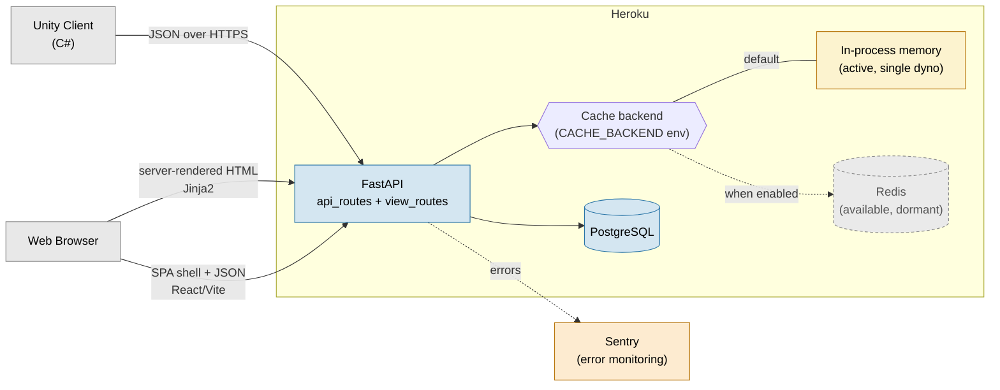
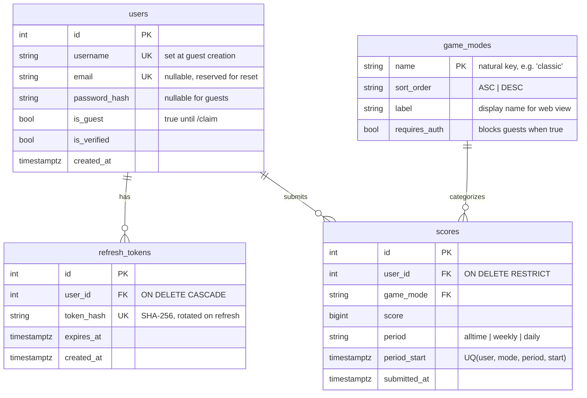
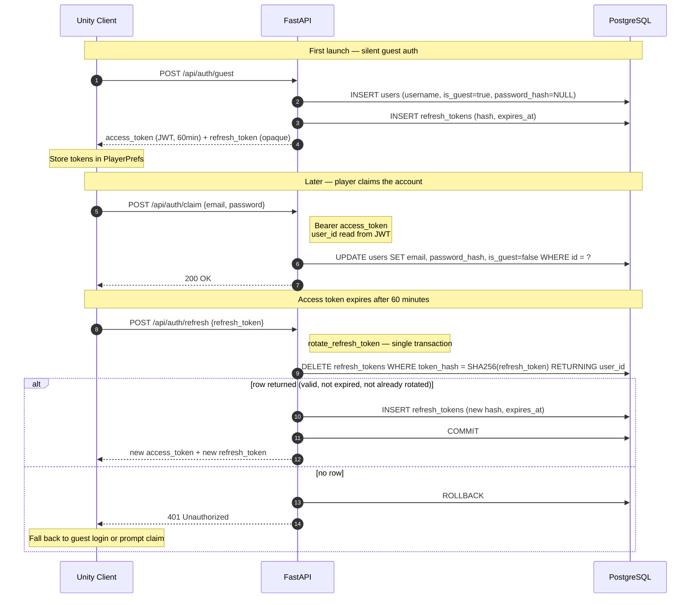
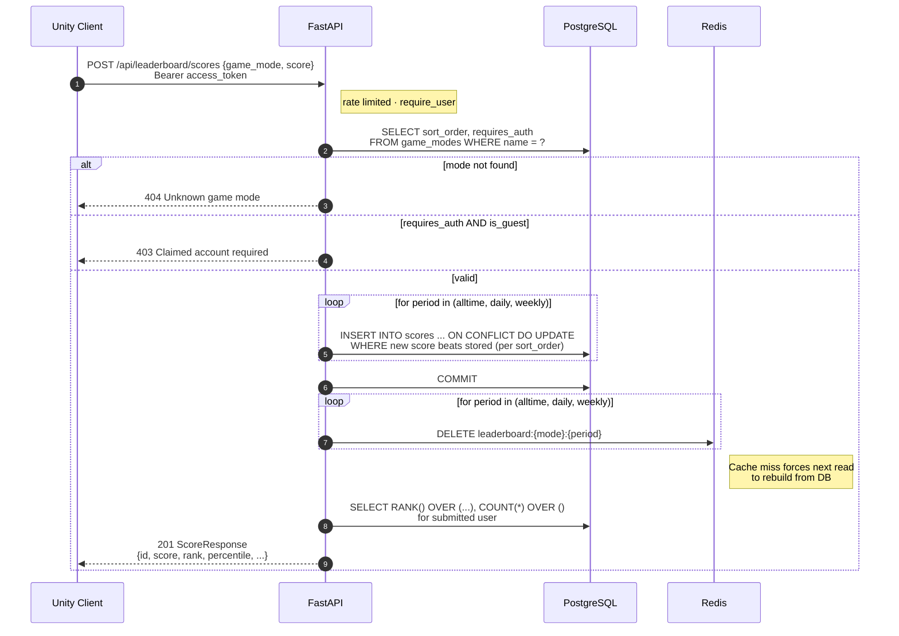

# HighScoreServer

A production-deployed game leaderboard backend built with FastAPI, PostgreSQL, and Redis.
Designed as a reusable backend for Unity games — any project can drop in the included
C# client and have a fully functional leaderboard with auth and score history visible through a shared public web view.

- **Live:** https://high-score-server-9db572197af4.herokuapp.com/
- **API Docs:** https://high-score-server-9db572197af4.herokuapp.com/docs


## Architecture Overview




## Features

- **Guest account flow** — Unity clients authenticate silently on first launch.
  No login screen required to submit scores. Accounts can be claimed later with
  email and password, preserving all existing score history.
- **Period bucketing** — scores are tracked across three independent windows:
  all-time, weekly, and daily. A single submission upserts into all three periods
  simultaneously.
- **Rate limiting** — many API endpoints are rate limited per client IP via slowapi  
  and Redis. Write endpoints and auth routes are more tightly constrained than reads 
  to reflect their relative abuse potential. Limits degrade gracefully to in-process 
  memory if Redis is unavailable, keeping the API live rather than failing closed.
- **Flexible sort order** — game modes are individually configured as highest-score
  or lowest-score wins. The same API and client code handles both — a speedrun mode
  and a points mode are treated symmetrically.
- **Rank and percentile** — computed server-side via SQL window functions. Every
  score response includes the player's rank and percentile standing.
- **Public leaderboard** — server-rendered HTML view at `/leaderboard` with
  per-mode tabs, rank, percentile, and medal highlights for the top three.
- **Unity C# client** — drop-in `LeaderboardService.cs` with coroutine-based
  API calls, typed response models, and an `ApiResult<T>` wrapper that surfaces
  errors without exceptions. Handles the full auth lifecycle including silent
  guest login, token storage via PlayerPrefs, and account claiming.
- **Error tracking** — Sentry integration captures unhandled exceptions with full 
  request context. Configured to sample 20% of requests for performance tracing 
  without saturating the free tier. The DSN is treated as optional monitoring config 
  so the app starts cleanly in environments where Sentry isn't provisioned.


## Local Setup

### Prerequisites
- Python 3.12+
- PostgreSQL
- Redis (or Memurai on Windows) — optional, caching and rate limiting fall back to in-process memory

### Steps

1. Clone the repo and create a virtual environment:
```bash
python -m venv .venv
.venv\Scripts\Activate.ps1  # Windows PowerShell
source .venv/bin/activate   # macOS/Linux
pip install -r requirements.txt
```

2. Copy the example environment file and fill in your values:
```bash
cp .env.example .env          # macOS/Linux
Copy-Item .env.example .env   # Windows Powershell
```
At minimum you'll need `DATABASE_URL`, `JWT_SECRET`, and `API_KEY`.
Redis and Sentry configuration is optional.

3. Create the local database and apply the schema:
```bash
psql -U postgres -c "CREATE DATABASE leaderboard;"
psql -U postgres -d leaderboard -f db/schema.sql
```

4. Optionally load seed data:
```bash
psql -U postgres -d leaderboard -f db/seed.sql
```

5. Start the development server:
```bash
uvicorn app.main:app --reload
```

6. Visit `http://localhost:8000/docs` to explore the API.


## API Reference

All API routes are prefixed with `/api`. Full request and response schemas,
including field types and example payloads, are available in the interactive
[API docs](https://high-score-server-9db572197af4.herokuapp.com/docs) - this
section covers the surface area and behavior; `/docs` covers the shapes.

Write endpoints and auth routes are rate limited per client IP. Reads are
unrestricted or lightly limited. Exact values provided by FastAPI rather than
this document to ensure accuracy without maintenance cost.

### Auth Model

The API has two distinct authentication mechanisms for two distinct principals:

- **Bearer tokens (JWT)** authenticate end users. Every player-scoped action —
  submitting scores, renaming, claiming a guest account — uses a bearer token.
  Guest accounts receive tokens silently on first launch, so this is transparent
  to the player.
- **API keys** authenticate the server operator. Administrative actions like
  creating or updating game modes use an API key and are not exposed to players,
  even authenticated ones.

This separation keeps operator concerns out of the user table and prevents a
compromised player account from reconfiguring the server.

### Auth — `/api/auth`

| Method | Route | Auth | Description |
|---|---|---|---|
| POST | `/guest` | Public | Create a guest account, returns tokens |
| POST | `/register` | Public | Register a claimed account, returns tokens |
| POST | `/login` | Public | Login, returns tokens |
| POST | `/refresh` | Public | Rotate refresh token, returns new tokens |
| POST | `/logout` | Public | Revoke refresh token |
| POST | `/rename` | Bearer | Rename the authenticated user |
| POST | `/claim` | Bearer | Upgrade guest account to claimed |

`/rename` returns **409** on username collision — the `users.username` UNIQUE
constraint is enforced at the DB layer and surfaced as a clean error rather
than a 500.

### Leaderboard — `/api/leaderboard`

| Method | Route | Auth | Description |
|---|---|---|---|
| GET | `/scores` | Public | Fetch leaderboard for a game mode and `period` |
| POST | `/scores` | Bearer | Submit a score |
| GET | `/latest` | Public | Fetch the 100 most recently submitted scores |
| GET | `/game_modes` | Public | List all registered game modes |
| POST | `/game_modes` | API Key | Create or update a game mode (Operator Action) |

#### GET `/scores` parameters
| Parameter | Type | Default | Description |
|---|---|---|---|
| `game_mode` | string | required | Game mode name |
| `period` | string | `alltime` | One of: `alltime`, `weekly`, `daily` |

#### POST `/scores` body
```json
{
  "score": 1500,
  "game_mode": "classic"
}
```

**Behavior:** Upserts on `(user_id, game_mode, period, period_start)`. Only 
updates if the new score is an improvement (respecting the game mode's sort
order). Returns the player's current best with rank and percentile.


## Architecture Diagrams

Three diagrams cover the parts of the system that are hardest to understand from
code alone: the data model, the authentication lifecycle, and what happens when
a score is submitted. The rationale behind these shapes lives in
[Architecture Decisions](#architecture-decisions) directly below.

### Data model



A few things worth noting that the diagram can't express cleanly:

- **`scores` is upsert-on-best, not append-only.** The `UNIQUE (user_id, game_mode, period, period_start)` constraint is what makes period bucketing work — each player has at most one row per period window, and submissions either improve it or no-op.
- **`ON DELETE RESTRICT` on `scores.user_id`** prevents accidental user deletion from silently destroying leaderboard history. Guest pruning explicitly checks for score ownership before deleting.
- **`game_modes.name` is a natural key.** Cardinality is tiny and stable, and it makes raw SQL and logs human-readable without joining.

### Authentication lifecycle

Covers the three flows a Unity client goes through: silent guest creation on
first launch, claiming the account later, and rotating an expired access token.



The `DELETE ... RETURNING` pattern is what makes refresh tokens single-use
safely. If two clients race to rotate the same token, exactly one `DELETE`
returns a row and the other gets nothing — no read-then-write window where
both could succeed.

### Score submission lifecycle

Covers the full path of `POST /api/leaderboard/scores`: validation, the
three-period upsert, cache invalidation, and the rank/percentile computation
that ships back in the response.



The cache participant is shown as Redis for clarity; in practice the cache
backend is selected via `CACHE_BACKEND` and falls back to in-process memory,
as shown in the [Architecture Overview](#architecture-overview). Both backends
honor the same key-delete contract.


## Architecture Decisions

These are the non-obvious choices worth understanding if you're reading the code.

### Guest accounts over nullable foreign keys
The common approach to anonymous score submission is a nullable `user_id` on the
score table. This creates a class of scores with no owner and complicates every
query that joins to users.

Instead, every score submission requires an authenticated user — but authentication
is silent. On first launch the Unity client calls `POST /api/auth/guest`, receives
a JWT, and stores it in PlayerPrefs. From that point the client is indistinguishable
from a registered user at the API layer. Guest accounts can be upgraded to claimed
accounts at any time; all scores transfer automatically since they're already
associated with the user's ID.

### Raw SQL over ORM
The leaderboard queries use window functions (`RANK()`, `COUNT(*) OVER()`),
period-bucketed upserts with conditional updates, and dynamic `ORDER BY` direction.
These resist ORM abstraction and would require `text()` fallbacks anyway. Raw SQL
with psycopg2 is more explicit, easier to reason about, and keeps the query logic
visible rather than hidden behind a query builder.

SQLAlchemy and Alembic are intentionally absent. The primary value of SQLAlchemy
at this scale is autogenerated migrations, which requires the ORM to be aware of
your models. Without the ORM, Alembic is just a migration runner with setup cost.
Schema changes are managed via `db/schema.sql` directly.

### Period bucketing via upsert
Each score submission writes to three rows simultaneously — one per period
(`alltime`, `daily`, `weekly`) — using `ON CONFLICT DO UPDATE WHERE` to preserve
the best score in each window. The `period_start` column anchors each row to its
time window, so when a new daily or weekly period begins, fresh rows are inserted
naturally without any cleanup job or scheduled reset.

### Ascending and descending sort order
Game modes declare their sort order (`ASC` or `DESC`) in the `game_modes` table.
A speedrun mode where lower times win and a points mode where higher scores win
are both first-class citizens. Sort direction is fetched from the DB before
every leaderboard query and used to construct the correct `ORDER BY` and
improvement predicate for upserts. The Unity client and web view adapt
automatically — neither has sort logic hardcoded.

### Sync over async
FastAPI supports async route handlers, but the psycopg2 driver is synchronous.
Running blocking DB calls inside `async def` handlers would block the event loop,
making async worse than sync in practice. All routes are `def` (synchronous),
which is honest about the blocking nature of the DB calls.

The migration path if concurrency becomes a bottleneck is psycopg2 → asyncpg
directly, keeping raw SQL. This is deferred until there is a concrete concurrency
problem rather than in anticipation of one.

### JWT + opaque refresh tokens
Access tokens are short-lived JWTs (60 minutes, HS256). Refresh tokens are
cryptographically random opaque strings stored as SHA-256 hashes in the database.
Refresh tokens are single-use — each refresh rotates to a new token, invalidating
the previous one. This limits the window of a stolen refresh token to one
rotation cycle.


## Unity Client

The `UnityClient/` directory contains a drop-in C# leaderboard client for Unity 6.

| File | Purpose |
|---|---|
| `LeaderboardService.cs` | All HTTP communication with the API |
| `LeaderboardModels.cs` | Typed request/response models |
| `LeaderboardConfig.cs` | ScriptableObject for base URL and API key configuration |
| `LeaderboardExample.cs` | Annotated usage example covering the full auth and score lifecycle |

### Setup
1. Copy the `UnityClient/` files into your Unity project
2. Install [Newtonsoft.Json for Unity] via Package Manager
3. Create a config asset: **Assets → Create → UBear → LeaderboardConfig**
4. Set the base URL to your Heroku app URL (no trailing slash)
5. Gitignore your config asset — no sensitive data currently, but it may be introduced.

### Authentication lifecycle

The client handles auth silently. On first launch, call `GuestLogin()` — a guest
account is created server-side and tokens are stored in `PlayerPrefs`. On every
subsequent launch the stored token is used directly. No login screen is required
to submit scores.

Guest accounts can be upgraded to claimed accounts at any time via `Claim()`.
All existing scores transfer automatically since they are already associated with
the user's ID server-side.

```csharp
private void Start()
{
    if (!_service.IsAuthenticated)
        StartCoroutine(_service.GuestLogin(OnGuestLogin));
}

// Upgrade to a claimed account from a registration form
public void ClaimAccount(string email, string password)
{
    StartCoroutine(_service.Claim(email, password, OnClaimed));
}
```

### Submitting scores

Score submission requires an authenticated user. The player name is derived
server-side from the Bearer token — callers supply only the score and game mode.
The server upserts — if the player already has a better score, the existing
record is preserved and returned.

```csharp
public void OnGameOver(int finalScore)
{
    StartCoroutine(_service.SubmitScore(finalScore, "classic", OnScoreSubmitted));
}

private void OnScoreSubmitted(ApiResult<ScoreResponse> result)
{
    if (!result.Success)
    {
        Debug.LogWarning($"[Leaderboard] {result.Error}");
        return;
    }
    Debug.Log($"Rank #{result.Data.Rank} — best score: {result.Data.Score}");
}
```

### Fetching the leaderboard

```csharp
// period is one of: "alltime", "daily", "weekly"
StartCoroutine(_service.GetScores("classic", OnScoresReceived, period: "weekly"));

private void OnScoresReceived(ApiResult<LeaderboardResponse> result)
{
    if (!result.Success) return;

    foreach (ScoreResponse entry in result.Data.Scores)
        Debug.Log($"#{entry.Rank} {entry.Player}: {entry.Score} ({entry.Percentile:F1}%)");
}
```

### Known limitations
- **Token expiry** — access tokens expire after 60 minutes. `EnsureAuthenticated` handles the missing-token case by falling through to guest login, but does not yet detect 401 responses from expired tokens mid-session. If a request fails with a 401, call `RefreshTokens()` and retry. Automatic retry on 401 is a known future improvement.
- **Token storage** — tokens are stored in `PlayerPrefs`, which is not encrypted.
  This is standard Unity practice for session tokens. The correct long-term
  answer is server-side revocation (JTI denylist) rather than client-side
  encryption.


## Project Structure

```
HighScoreServer/
├── app/
│   ├── main.py               # App factory, lifespan startup/shutdown
│   ├── auth.py               # JWT, bcrypt, refresh token logic
│   ├── auth_routes.py        # Auth endpoints
│   ├── leaderboard_routes.py # Leaderboard endpoints
│   ├── view_routes.py        # Server-rendered HTML endpoints
│   ├── models.py             # Pydantic request/response schemas
│   ├── periods.py            # Period bucketing logic
│   ├── db.py                 # psycopg2 connection pool
│   ├── cache.py              # Redis client with graceful fallback
│   ├── dependencies.py       # Auth dependencies (require_user, require_api_key)
│   └── env.py                # Environment variable loading and validation
├── db/
│   ├── schema.sql            # Database schema
│   ├── seed.sql              # Local development seed data
│   └── role.sql              # Minimal-permission DB role for production
├── scripts/
│   └── prune_guests.py       # Removes scoreless guest accounts older than GUEST_PRUNE_DAYS
├── templates/
│   ├── base.html             # Base template
│   ├── home.html             # Home page
│   └── leaderboard.html      # Leaderboard view
├── public/
│   ├── index.html            # Redirect to home
│   └── style.css             # Leaderboard styles
├── leaderboard-frontend/     # React 18 + Vite + TypeScript SPA (dev branch, not yet integrated)
├── tests/
│   ├── conftest.py           # Fixtures: test client, DB cleanup, cache disable
│   ├── test_periods.py       # Unit tests for period bucketing
│   ├── test_api_scores.py    # Integration tests for leaderboard routes
│   ├── test_api_auth.py      # Integration tests for auth routes
│   └── test_prune_guests.py  # Integration tests for guest pruning
├── UnityClient/
│   ├── LeaderboardService.cs
│   ├── LeaderboardModels.cs
│   ├── LeaderboardConfig.cs
│   └── LeaderboardExample.cs
├── requirements.txt
├── Procfile
├── runtime.txt
├── wsgi.py
└── .env.example
```


## Deployment

```bash
heroku create your-app-name
heroku addons:create heroku-postgresql:essential-0
heroku addons:create heroku-redis:mini
heroku config:set API_KEY=your-production-secret
heroku config:set JWT_SECRET=your-jwt-secret

# MacOS/Linux
heroku pg:psql < db/schema.sql
# Powershell
Get-Content db\schema.sql | heroku pg:psql --app your-app-name

git push heroku main
```

### Guest account cleanup
```bash
heroku addons:create scheduler:standard
heroku addons:open scheduler
# Add job: python -m scripts.prune_guests — daily frequency
```

Scoreless guest accounts older than `GUEST_PRUNE_DAYS` (default: 30) are pruned.
Guest accounts with scores are intentionally preserved.


## Known Future Considerations

- **Access token revocation** — `# DENYLIST HOOK` comments mark the insertion points.
  Requires a Redis JTI denylist checked on every decode.
- **`leaderboard:latest` cache invalidation** — score submission currently invalidates
  the three period keys (`leaderboard:{mode}:{period}`) but not `leaderboard:latest`.
  A new submission won't appear in the "100 most recent" view until the 120s TTL
  expires. Fix is a one-line `cache.delete("leaderboard:latest")` in `submit_score`
  alongside the existing period-key invalidation loop.
- **Async migration** — psycopg2 → asyncpg if concurrency becomes a bottleneck.
  Neither SQLAlchemy nor Alembic are in scope for this migration.
- **Guest cleanup for accounts with scores** — scoreless guests are pruned automatically.
  Pruning guests with score history requires a separate retention policy decision.
- **Password reset** — requires token storage, email delivery, and new UI. The `email`
  column is already nullable on the `users` table to keep the schema ready.
- **Redis Fallback** - Redis already falls back gracefully when not provided, but to 
  preserve funds a local caching solution will be implemented for single dyno environments.