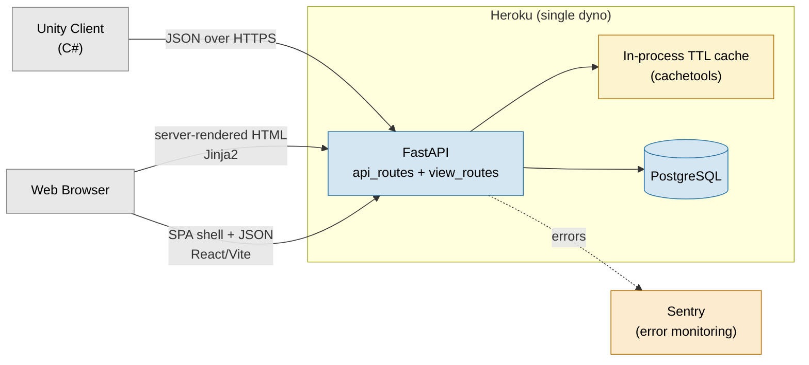
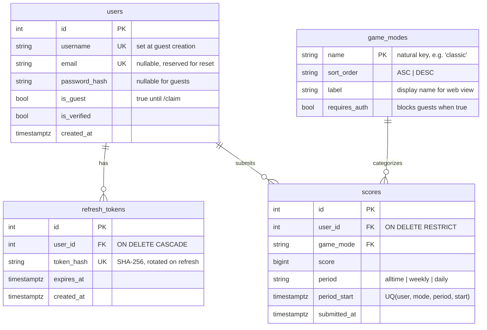
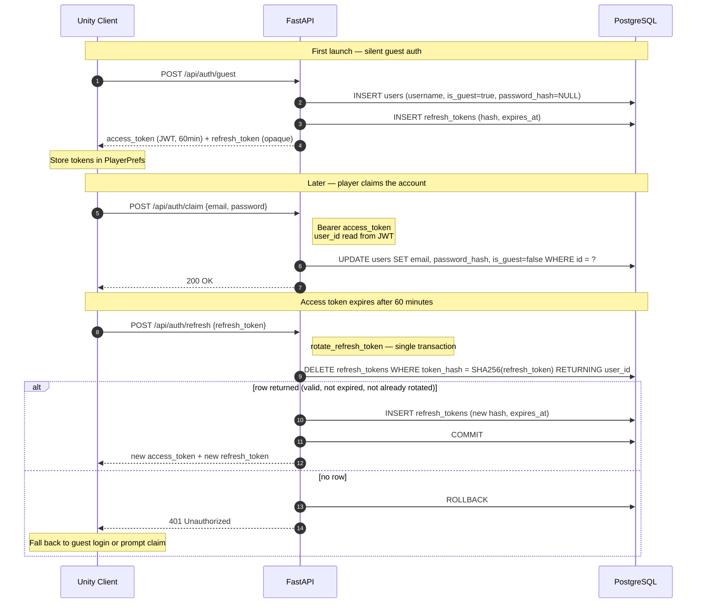

# HighScoreServer

A production-deployed game leaderboard backend built with FastAPI and PostgreSQL. Designed as a reusable backend for Unity games — drop in the included C# client and get a fully functional leaderboard with silent guest auth, per-period score history, rank and percentile, and a public web view.

Architectural decisions are captured as ADRs, and Known Limitations documents the current tradeoffs.

- **Live:** https://high-score-server-9db572197af4.herokuapp.com/
- **API Docs:** https://high-score-server-9db572197af4.herokuapp.com/docs


## Architecture Overview



> **Cache backend.** The deployed configuration uses an in-process TTL cache (`CACHE_BACKEND=memory`). Redis is supported by the same cache interface and can be re-enabled by provisioning the Heroku Redis add-on and setting `CACHE_BACKEND=redis` — no code changes required. At a single dyno with a single worker, the two backends are behaviorally equivalent, so the add-on was removed to eliminate cost.


## Features

- **Guest account flow** — Unity clients authenticate silently on first launch.
  No login screen required to submit scores. Accounts can be claimed later with
  email and password, preserving all existing score history.
- **Period bucketing** — scores are tracked across three independent windows:
  all-time, weekly, and daily. A single submission upserts into all three periods
  simultaneously.
- **Rate limiting** — write endpoints and auth routes are rate limited per
  client IP via slowapi, tuned to reflect their relative abuse potential.
  The deployed configuration uses in-process memory storage; the limiter
  also falls through to memory if a configured Redis is unreachable, so a
  Redis blip degrades rate limiting rather than taking the API down. Both
  backends are driven by `CACHE_BACKEND` — flipping the cache and the
  limiter to Redis is a single config change (see [ADR 0007](docs/adr/0007-in-process-cache-over-redis.md)).
- **Flexible sort order** — game modes are individually configured as highest-score
  or lowest-score wins. The same API and client code handles both — a speedrun mode
  and a points mode are treated symmetrically.
- **Rank and percentile** — computed server-side via SQL window functions. Every
  score response includes the player's rank and percentile standing.
- **Public leaderboard** — server-rendered HTML view at `/leaderboard` with
  per-mode tabs, rank, percentile, and medal highlights for the top three.
- **Unity C# client** — drop-in `LeaderboardService.cs` with coroutine-based
  API calls, typed response models, and an `ApiResult<T>` wrapper that surfaces
  errors without exceptions. Handles the full auth lifecycle including silent
  guest login, token storage via PlayerPrefs, and account claiming.
- **Error tracking** — Sentry integration captures unhandled exceptions with full 
  request context. Configured to sample 20% of requests for performance tracing 
  without saturating the free tier. The DSN is treated as optional monitoring config 
  so the app starts cleanly in environments where Sentry isn't provisioned.


## Local Setup

### Prerequisites
- Python 3.12+
- PostgreSQL
- Redis (or Memurai on Windows) — Implemented for scalable caching, but not required for normal development or single dyno deployment. Caching and rate limiting default to in-process memory; Redis is only needed if you want to exercise the Redis code path locally (see [ADR 0007](docs/adr/0007-in-process-cache-over-redis.md))

### Steps

1. Clone the repo and create a virtual environment:
```bash
python -m venv .venv
.venv\Scripts\Activate.ps1  # Windows PowerShell
source .venv/bin/activate   # macOS/Linux
pip install -r requirements.txt
```

2. Copy the example environment file and fill in your values:
```bash
Copy-Item .env.example .env   # Windows Powershell
cp .env.example .env          # macOS/Linux
```
At minimum you'll need `DATABASE_URL`, `JWT_SECRET`, and `API_KEY`.
Redis and Sentry configuration is optional.

3. Create the local database and apply the schema:
```bash
psql -U postgres -c "CREATE DATABASE leaderboard;"
psql -U postgres -d leaderboard -f db/schema.sql
```

4. Optionally load seed data:
```bash
psql -U postgres -d leaderboard -f db/seed.sql
```

5. Start the development server:
```bash
uvicorn app.main:app --reload
```

6. Visit `http://localhost:8000/docs` to explore the API.


## Architecture Diagrams

Three diagrams cover the parts of the system that are hardest to understand from
code alone: the data model, the authentication lifecycle, and what happens when
a score is submitted. The rationale behind these shapes lives in
[Architecture Decisions](#architecture-decisions) directly below.

### Data model



A few things worth noting that the diagram can't express cleanly:

- **`scores` is upsert-on-best, not append-only.** The `UNIQUE (user_id, game_mode, period, period_start)` constraint is what makes period bucketing work — each player has at most one row per period window, and submissions either improve it or no-op.
- **`ON DELETE RESTRICT` on `scores.user_id`** prevents accidental user deletion from silently destroying leaderboard history. Guest pruning explicitly checks for score ownership before deleting.
- **`game_modes.name` is a natural key.** Cardinality is tiny and stable, and it makes raw SQL and logs human-readable without joining.

### Authentication lifecycle

Covers the three flows a Unity client goes through: silent guest creation on
first launch, claiming the account later, and rotating an expired access token.



The `DELETE ... RETURNING` pattern is what makes refresh tokens single-use
safely. If two clients race to rotate the same token, exactly one `DELETE`
returns a row and the other gets nothing — no read-then-write window where
both could succeed.

### Score submission lifecycle

Covers the full path of `POST /api/leaderboard/scores`: validation, the
three-period upsert, cache invalidation, and the rank/percentile computation
that ships back in the response.


The cache participant is labeled "Cache" in the diagram because it's backend-agnostic — 
the deployed configuration uses an in-process TTL cache, and Redis is supported by the 
same interface (see [Architecture Overview](#architecture-overview)). Both backends honor 
the same key-delete contract.


## API Reference

All API routes are prefixed with `/api`. Full request and response schemas,
including field types and example payloads, are available in the interactive
[API docs](https://high-score-server-9db572197af4.herokuapp.com/docs) - this
section covers the surface area and behavior; `/docs` covers the shapes.

Write endpoints and auth routes are rate limited per client IP. Reads are
unrestricted or lightly limited. Exact values provided by FastAPI rather than
this document to ensure accuracy without maintenance cost.

### Auth Model

The API has two distinct authentication mechanisms for two distinct principals:

- **Bearer tokens (JWT)** authenticate end users. Every player-scoped action —
  submitting scores, renaming, claiming a guest account — uses a bearer token.
  Guest accounts receive tokens silently on first launch, so this is transparent
  to the player.
- **API keys** authenticate the server operator. Administrative actions like
  creating or updating game modes use an API key and are not exposed to players,
  even authenticated ones.

This separation keeps operator concerns out of the user table and prevents a
compromised player account from reconfiguring the server.

### Error Contract

The API returns two distinct error shapes, both under the `detail` key:

- **`{"detail": "string"}`** — raised explicitly via `HTTPException`. Used for
  401, 403, 404, 409, and application-level 400s. The string is a
  human-readable message suitable for logging or displaying to developers.
- **`{"detail": [ {...}, {...} ]}`** — raised automatically by FastAPI when a
  request fails Pydantic validation. Used for 422. Each array entry describes
  one validation failure with `loc`, `msg`, and `type` fields.

Both shapes share the same top-level key, which means a naive client that
reads `response.detail` as a string will break on validation errors. The
C# client's `TryExtractDetail` handles both shapes and normalizes them into
a single string for logging, and the structured `ApiResult<T>.ErrorKind`
enum lets callers branch on the failure category without parsing strings at
all.

#### `ApiErrorKind` values

| Kind | HTTP | Meaning |
|---|---|---|
| `None` | — | Success. `Error` and `StatusCode` are unset. |
| `Network` | — | Connection failed, DNS lookup failed, or timeout. No HTTP response was received. |
| `BadRequest` | 400 | Malformed request — the server understood the shape but rejected the content. |
| `Unauthorized` | 401 | Missing, invalid, or expired token. Client should refresh or fall back to guest login. |
| `Forbidden` | 403 | Authenticated but not allowed — e.g. a guest hitting a `requires_auth` game mode. |
| `NotFound` | 404 | Unknown resource — typically an unknown `game_mode`. |
| `Conflict` | 409 | Resource collision — e.g. username already taken during `/rename`. |
| `Validation` | 422 | Pydantic validation error. The server's `detail` payload is an array, not a string. |
| `RateLimited` | 429 | Per-IP rate limit exceeded. Client should back off. |
| `Server` | 5xx | Server-side failure. Retry with backoff is appropriate. |
| `ParseError` | — | Response received but couldn't deserialize — usually a contract mismatch. |

`None` is idiomatic C# as a success sentinel. The enum covers named failure
categories, not every HTTP status — unexpected statuses (e.g., 3xx redirects)
fall through to `ParseError` or `Server` depending on whether the body
deserializes.

#### Handling errors on the C# side

```csharp
private void OnScoreSubmitted(ApiResult<ScoreResponse> result)
{
    if (result.Success)
    {
        Debug.Log($"Rank #{result.Data.Rank} — best score: {result.Data.Score}");
        return;
    }

    switch (result.ErrorKind)
    {
        case ApiErrorKind.Unauthorized:
            // Token expired mid-session. Refresh and retry.
            StartCoroutine(_service.RefreshTokens(OnRefreshed));
            break;

        case ApiErrorKind.Forbidden:
            // Guest account hit a requires_auth game mode. Prompt to claim.
            ShowClaimAccountDialog();
            break;

        case ApiErrorKind.RateLimited:
            // Back off and retry with exponential delay.
            StartCoroutine(RetryAfterDelay(result));
            break;

        case ApiErrorKind.Network:
        case ApiErrorKind.Server:
            // Transient. Show a "try again later" banner.
            ShowTransientErrorBanner(result.Error);
            break;

        default:
            // BadRequest, Validation, NotFound, Conflict, ParseError —
            // not expected during normal play. Log for debugging.
            Debug.LogWarning($"[Leaderboard] {result.ErrorKind}: {result.Error}");
            break;
    }
}
```

The value of the enum is that each branch corresponds to a different *user-facing*
response, not just a different log line. `Unauthorized` triggers a refresh,
`Forbidden` triggers a claim flow, `RateLimited` triggers backoff — these are
decisions the client has to make, and the enum is more explicit than a return code.

### Auth — `/api/auth`

| Method | Route | Auth | Description |
|---|---|---|---|
| POST | `/guest` | Public | Create a guest account, returns tokens |
| POST | `/register` | Public | Register a claimed account, returns tokens |
| POST | `/login` | Public | Login, returns tokens |
| POST | `/refresh` | Public | Rotate refresh token, returns new tokens |
| POST | `/logout` | Public | Revoke refresh token |
| POST | `/rename` | Bearer | Rename the authenticated user |
| POST | `/claim` | Bearer | Upgrade guest account to claimed |

`/rename` returns **409** on username collision — the `users.username` UNIQUE
constraint is enforced at the DB layer and surfaced as a clean error rather
than a 500.

### Leaderboard — `/api/leaderboard`

| Method | Route | Auth | Description |
|---|---|---|---|
| GET | `/scores` | Public | Fetch leaderboard for a game mode and `period` |
| POST | `/scores` | Bearer | Submit a score |
| GET | `/latest` | Public | Fetch the 100 most recently submitted scores |
| GET | `/game_modes` | Public | List all registered game modes |
| POST | `/game_modes` | API Key | Create or update a game mode (Operator Action) |

#### GET `/scores` parameters
| Parameter | Type | Default | Description |
|---|---|---|---|
| `game_mode` | string | required | Game mode name |
| `period` | string | `alltime` | One of: `alltime`, `weekly`, `daily` |

#### POST `/scores` body
```json
{
  "score": 1500,
  "game_mode": "classic"
}
```

**Behavior:** Upserts on `(user_id, game_mode, period, period_start)`. Only 
updates if the new score is an improvement (respecting the game mode's sort
order). Returns the player's current best with rank and percentile.


## Architecture Decisions

The non-obvious architectural choices in this project — and the reasoning
behind them — are documented as [Architecture Decision Records](docs/adr/)
in the Nygard format. Start with the [index](docs/adr/README.md) for a
one-line summary of each decision.


## Unity Client

The `UnityClient/` directory contains a drop-in C# leaderboard client for Unity 6.

| File | Purpose |
|---|---|
| `LeaderboardService.cs` | All HTTP communication with the API |
| `LeaderboardModels.cs` | Typed request/response models |
| `LeaderboardConfig.cs` | ScriptableObject for base URL and API key configuration |
| `LeaderboardExample.cs` | Annotated usage example covering the full auth and score lifecycle |

### Setup
1. Copy the `UnityClient/` files into your Unity project
2. Install [Newtonsoft.Json for Unity] via Package Manager
3. Create a config asset: **Assets → Create → UBear → LeaderboardConfig**
4. Set the base URL to your Heroku app URL (no trailing slash)
5. Gitignore your config asset — no sensitive data currently, but it may be introduced.
6. **Note on `submitted_at`**: the field is typed as `string` on `ScoreResponse`, not `DateTime`.
   This is a deliberate dodge of Newtonsoft's default local-time conversion, which would silently
   shift timestamps based on the player's device timezone. Parse it explicitly with
   `DateTimeOffset.Parse(...)` if you need a typed value — the server always emits UTC ISO 8601.

### Authentication lifecycle

The client handles auth silently. On first launch, call `GuestLogin()` — a guest
account is created server-side and tokens are stored in `PlayerPrefs`. On every
subsequent launch the stored token is used directly. No login screen is required
to submit scores.

Guest accounts can be upgraded to claimed accounts at any time via `Claim()`.
All existing scores transfer automatically since they are already associated with
the user's ID server-side.

```csharp
private void Start()
{
    if (!_service.IsAuthenticated)
        StartCoroutine(_service.GuestLogin(OnGuestLogin));
}

// Upgrade to a claimed account from a registration form
public void ClaimAccount(string email, string password)
{
    StartCoroutine(_service.Claim(email, password, OnClaimed));
}
```
Logout is best-effort. _service.Logout() attempts to revoke the refresh
token server-side, but clears the locally stored tokens regardless of whether
the server call succeeds. This is the right behavior — a failed logout should
not leave the client in a state where it thinks it's still authenticated —
but it means a logout during network failure succeeds locally and fails
server-side, leaving the refresh token valid until its natural expiry. The
mitigation is the refresh token's own lifetime, which is short enough that
the window of exposure is bounded.

### Submitting scores

Score submission requires an authenticated user. The player name is derived
server-side from the Bearer token — callers supply only the score and game mode.
The server upserts — if the player already has a better score, the existing
record is preserved and returned.

```csharp
public void OnGameOver(int finalScore)
{
    StartCoroutine(_service.SubmitScore(finalScore, "classic", OnScoreSubmitted));
}

private void OnScoreSubmitted(ApiResult<ScoreResponse> result)
{
    if (!result.Success)
    {
        Debug.LogWarning($"[Leaderboard] {result.Error}");
        return;
    }
    Debug.Log($"Rank #{result.Data.Rank} — best score: {result.Data.Score}");
}
```

### Fetching the leaderboard

```csharp
// period is one of: "alltime", "daily", "weekly"
StartCoroutine(_service.GetScores("classic", OnScoresReceived, period: "weekly"));

private void OnScoresReceived(ApiResult<LeaderboardResponse> result)
{
    if (!result.Success) return;

    foreach (ScoreResponse entry in result.Data.Scores)
        Debug.Log($"#{entry.Rank} {entry.Player}: {entry.Score} ({entry.Percentile:F1}%)");
}
```

### Known limitations
- **Automatic retry on 401** — `EnsureAuthenticated` handles the missing-token
  case by falling through to guest login, but does not detect 401 responses
  from expired tokens mid-session. If a request fails with a 401, call
  `RefreshTokens()` and retry. Automatic retry is a known future improvement.
- **Token storage** — tokens are stored in `PlayerPrefs`, which is not encrypted.
  This is standard Unity practice for session tokens. The correct long-term
  answer is server-side revocation (JTI denylist) rather than client-side
  encryption.


## Project Structure

```
HighScoreServer/
├── app/
│   ├── main.py               # App factory, lifespan startup/shutdown
│   ├── auth.py               # JWT, bcrypt, refresh token logic
│   ├── auth_routes.py        # Auth endpoints
│   ├── leaderboard_routes.py # Leaderboard endpoints
│   ├── view_routes.py        # Server-rendered HTML endpoints
│   ├── models.py             # Pydantic request/response schemas
│   ├── periods.py            # Period bucketing logic
│   ├── db.py                 # psycopg2 connection pool
│   ├── cache.py              # Pluggable cache interface (in-process TTL default, Redis optional)
│   ├── dependencies.py       # Auth dependencies (require_user, require_api_key)
│   └── env.py                # Environment variable loading and validation
├── db/
│   ├── schema.sql            # Database schema
│   ├── seed.sql              # Local development seed data
│   └── role.sql              # Minimal-permission DB role for production
├── scripts/
│   └── prune_guests.py       # Removes scoreless guest accounts older than GUEST_PRUNE_DAYS
├── templates/
│   ├── base.html             # Base template
│   ├── home.html             # Home page
│   └── leaderboard.html      # Leaderboard view
├── public/
│   ├── index.html            # Redirect to home
│   └── style.css             # Leaderboard styles
├── leaderboard-frontend/     # React 18 + Vite + TypeScript SPA (dev branch, not yet integrated)
├── tests/
│   ├── conftest.py           # Fixtures: test client, DB cleanup, cache disable
│   ├── test_periods.py       # Unit tests for period bucketing
│   ├── test_api_scores.py    # Integration tests for leaderboard routes
│   ├── test_api_auth.py      # Integration tests for auth routes
│   └── test_prune_guests.py  # Integration tests for guest pruning
├── UnityClient/
│   ├── LeaderboardService.cs
│   ├── LeaderboardModels.cs
│   ├── LeaderboardConfig.cs
│   └── LeaderboardExample.cs
├── requirements.txt
├── Procfile
├── runtime.txt
├── wsgi.py
└── .env.example
```


## Deployment

```bash
heroku create your-app-name
heroku addons:create heroku-postgresql:essential-0
heroku config:set API_KEY=your-production-secret
heroku config:set JWT_SECRET=your-jwt-secret

# Optional: enable Redis-backed cache and rate limiting
# heroku addons:create heroku-redis:mini
# heroku config:set CACHE_BACKEND=redis

# MacOS/Linux
heroku pg:psql < db/schema.sql
# Powershell
Get-Content db\schema.sql | heroku pg:psql --app your-app-name

git push heroku main
```

### Guest account cleanup
```bash
heroku addons:create scheduler:standard
heroku addons:open scheduler
# Add job: python -m scripts.prune_guests — daily frequency
```

Scoreless guest accounts older than `GUEST_PRUNE_DAYS` (default: 30) are pruned.
Guest accounts with scores are intentionally preserved.


## Known Limitations

These are the tradeoffs the current design accepts deliberately. Each one has
a documented trigger for revisiting — none are "we forgot." If a limitation
has a full ADR behind it, that ADR is the authoritative source and this
section is the summary.

- **Access tokens cannot be revoked within their 60-minute lifetime.** A stolen
  access token is valid until it expires; there is no server-side kill switch.
  The mitigation is the short lifetime itself — blast radius is bounded to one
  hour — and the refresh token (which *can* be revoked) is what gates
  longer-lived access. **Trigger for revisiting:** a known compromise, an
  account-claim flow that wants to invalidate the guest's prior tokens, or any
  threat model where one hour is too long. The full fix is a JTI denylist
  checked at decode time; insertion points are marked in the codebase with
  `# DENYLIST HOOK` comments. See [ADR 0006](docs/adr/0006-jwt-plus-opaque-refresh-tokens.md)
  for the full reasoning.
- **Rate limiting and cache invalidation are per-process.** Both share a root
  cause: the in-process storage chosen in [ADR 0007](docs/adr/0007-in-process-cache-over-redis.md)
  is correct at single-process scale but degrades the moment a second worker
  appears. **Trigger for revisiting:** any move beyond single-process deployment
  (second dyno, second uvicorn worker, background job process). The mitigation
  is already in place — setting `CACHE_BACKEND=redis` and provisioning the
  Heroku Redis add-on flips both subsystems to Redis-backed storage in one
  config change.

  - **Rate limits** currently use slowapi's in-process memory storage. At
    single-dyno, single-worker scale this is correct, but the moment the process
    count increases the documented limit silently weakens to N× its stated
    value: an attacker who gets load-balanced across N workers can make N times
    the allowed requests, with no visible symptom until someone tries to abuse
    it.

  - **Cache invalidation** is local to each process. A score submission served
    by process A invalidates process A's cache keys, but process B will continue
    serving stale leaderboard data until its own copy expires by TTL (currently
    120 seconds). This is a freshness issue, not a correctness one — stale data
    is still valid data, just older than it should be.

- **Three scenarios are deliberately untested.** Each was considered and
  deferred with a specific reason, not missed:
  - **Guest-retry exhaustion.** The guest account creation loop retries on
    username collision up to a small bound. Exercising the exhaustion path in
    a test requires either mocking the username generator (which tests the
    mock, not the code) or generating enough collisions to exhaust the retry
    budget legitimately (which is too slow to justify). The loop bound is small
    and the collision probability is low; the scenario is accepted as tested
    by inspection.
  - **Refresh-rotation race.** The `DELETE ... RETURNING` pattern makes refresh
    rotation race-safe at the database level (see the ADR 0006 consequences).
    Testing the race requires a real concurrency harness with two clients
    hitting the refresh endpoint simultaneously, which isn't worth building
    at current scale. The correctness argument rests on PostgreSQL's atomicity
    guarantees, not on test coverage.
  - **FK violation on score submission.** `submit_score` catches
    `psycopg2.errors.ForeignKeyViolation` and returns 400. Triggering a real FK
    violation in a test requires creating a score for a game mode and/or user that 
    is then deleted between the Pydantic validation and the INSERT — a window that
    doesn't naturally occur in a synchronous handler. The alternative is
    mocking psycopg2 to raise the exception, which would test the `except`
    block but not the scenario it exists to handle.


## Known Future Considerations

- **Access token revocation** — `# DENYLIST HOOK` comments mark the insertion points.
  Requires a Redis JTI denylist checked on every decode.
- **Async migration** — psycopg2 → asyncpg if concurrency becomes a bottleneck.
  Neither SQLAlchemy nor Alembic are in scope for this migration.
- **Guest cleanup for accounts with scores** — scoreless guests are pruned automatically.
  Pruning guests with score history requires a separate retention policy decision.
- **Password reset** — requires token storage, email delivery, and new UI. The `email`
  column is already nullable on the `users` table to keep the schema ready.