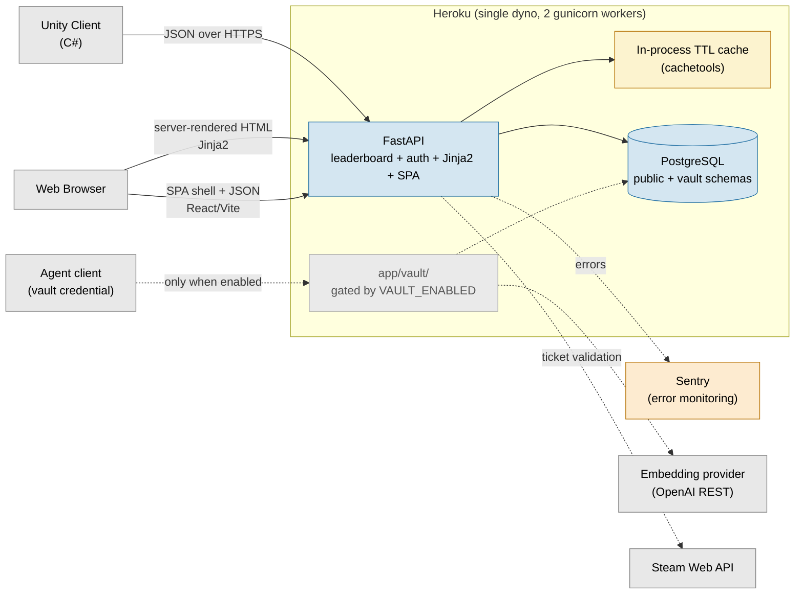
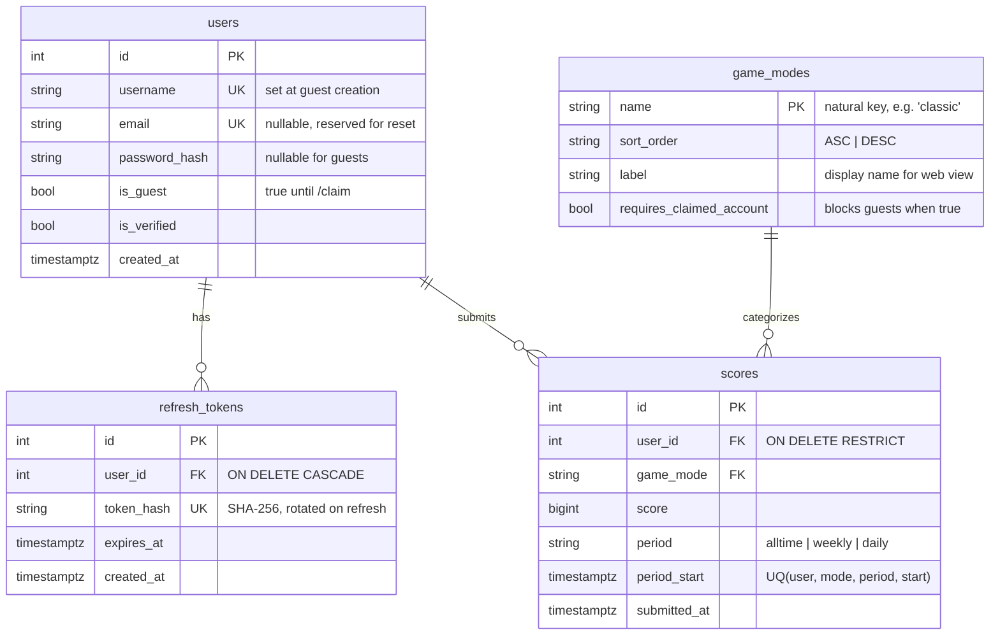
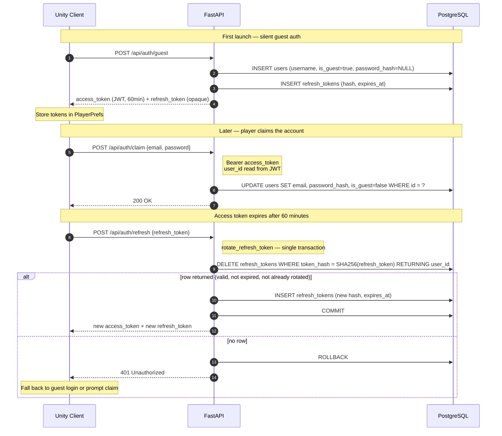
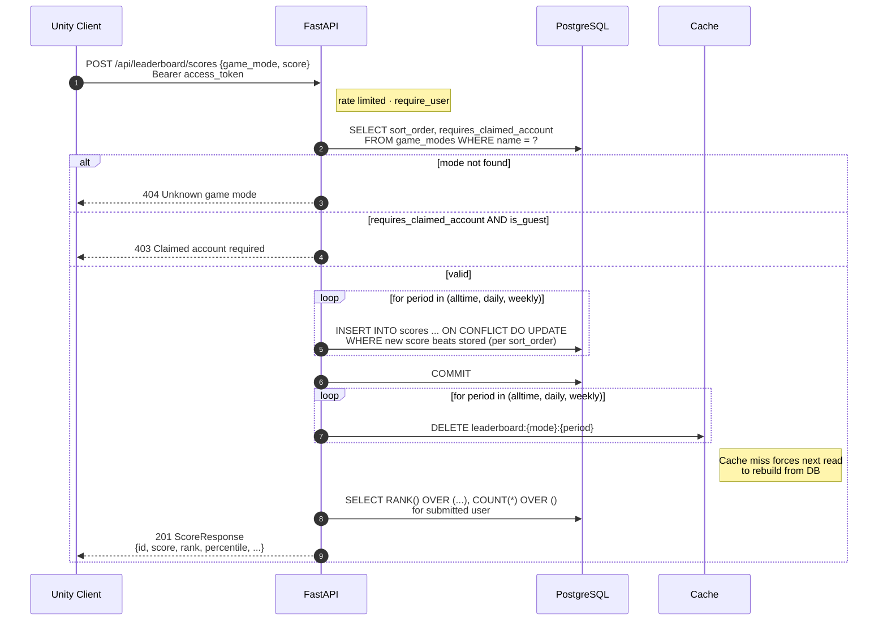

# HighScoreServer

[](https://github.com/EricMay256/HighScoreServer/actions/workflows/ci.yml)

A production-deployed game leaderboard backend built with FastAPI and PostgreSQL. Designed as a reusable backend for Unity games — drop in the [Unity client](https://github.com/EricMay256/hss-unity) and get a fully functional leaderboard with silent guest auth, per-period score history, rank and percentile, and a public web view.

Architectural decisions are captured as [ADRs](docs/adr/README.md), and Known Limitations documents the current tradeoffs.

- **Live:** [https://high-score-server-9db572197af4.herokuapp.com/]
- **API Docs:** [https://high-score-server-9db572197af4.herokuapp.com/docs]

## Related Repositories

There are multiple clients for the HighScoreServer, aimed at providing coverage for mainstream game engines.

- **Unity:** [https://github.com/EricMay256/hss-unity]
- **C++:** [https://github.com/EricMay256/hss-cpp]
- **Unreal:** [https://github.com/EricMay256/hss-unreal] (wraps C++ adapter)

## Architecture Overview


```mermaid
flowchart LR
    Unity["Unity Client<br/>(C#)"]
    Browser["Web Browser"]
    Agent["Agent client<br/>(vault credential)"]
    subgraph Heroku["Heroku (single dyno, 2 gunicorn workers)"]
        API["FastAPI<br/>leaderboard + auth + Jinja2 + SPA"]
        Cache["In-process TTL cache<br/>(cachetools)"]
        Vault["app/vault/<br/>gated by VAULT_ENABLED"]
        Postgres[("PostgreSQL<br/>public + vault schemas")]
    end
    Sentry["Sentry<br/>(error monitoring)"]
    Embeddings["Embedding provider<br/>(OpenAI REST)"]
    Steam["Steam Web API"]
    Unity -->|JSON over HTTPS| API
    Browser -->|server-rendered HTML<br/>Jinja2| API
    Browser -->|SPA shell + JSON<br/>React/Vite| API
    Agent -.->|only when enabled| Vault
    API --> Postgres
    API --> Cache
    API -.->|ticket validation| Steam
    Vault -.-> Postgres
    Vault -.-> Embeddings
    API -.->|errors| Sentry
    classDef external fill:#e8e8e8,stroke:#888,color:#000
    classDef infra fill:#d4e6f1,stroke:#2874a6,color:#000
    classDef ephemeral fill:#fcf3cf,stroke:#b9770e,color:#000
    classDef monitoring fill:#fdebd0,stroke:#b9770e,color:#000
    classDef gated fill:#eaeaea,stroke:#aaa,color:#555
    class Unity,Browser,Agent,Steam,Embeddings external
    class API,Postgres infra
    class Cache ephemeral
    class Sentry monitoring
    class Vault gated
```

> **The vault is feature-gated.** `VAULT_ENABLED` defaults to false, so a fresh
> deployment publishes no vault routes, no vault engine, and no vault schema. The
> production app has run with it enabled since August 2026: the dashed paths above
> exist there because the flag is set, not by default. See
> [Deployment configuration](#deployment-configuration) and the
> [vault runbook](app/vault/docs/vault-configuration.md).

> **Cache backend.** The deployed configuration uses an in-process TTL cache (`CACHE_BACKEND=memory`). Redis is opt-in using the same cache interface and can be re-enabled by provisioning the Heroku Redis add-on and setting `CACHE_BACKEND=redis` — no code changes required. At a single dyno the only difference is that cache and limiter state are per Gunicorn worker rather than shared (see [Known Limitations](#known-limitations)), which was judged acceptable, so the add-on was removed to reduce cost.


## Features

- **Guest account flow** — Unity clients authenticate silently on first launch.
  No login screen required to submit scores. Accounts can be claimed later with
  email and password, preserving all existing score history.
- **Period bucketing** — scores are tracked across three independent windows:
  all-time, weekly, and daily. A single submission upserts into all three periods
  simultaneously.
- **Rate limiting** — write endpoints and auth routes are rate limited per
  client IP via slowapi, tuned to reflect their relative abuse potential.
  Limits are per route and nothing is limited globally: each limited endpoint
  carries its own `@limiter.limit`, so an unlimited route is unlimited by
  omission rather than covered by a default.
  The deployed configuration uses in-process memory storage; the limiter
  also falls through to memory if a configured Redis is unreachable, so a
  Redis blip degrades rate limiting rather than taking the API down. Both
  backends are driven by `CACHE_BACKEND` — flipping the cache and the
  limiter to Redis is a single config change (see [ADR 0007](docs/adr/0007-in-process-cache-over-redis.md)).
- **Flexible sort order** — game modes are individually configured as highest-score
  or lowest-score wins. The same API and client code handles both — a speedrun mode
  and a points mode are treated symmetrically.
- **Rank and percentile** — computed server-side via SQL window functions. Every
  score response includes the player's rank and percentile standing.
- **External identities** — `users` is the durable leaderboard identity and
  `auth_identities` is the set of ways it can be proven, so a provider is a row
  rather than a nullable column per vendor. Native email/password is the `ubear`
  provider; Steam is validated server-side against the Steam Web API, never from
  a client-supplied SteamID (see [ADR 0015](docs/adr/0015-auth-identities-over-provider-columns.md)).
  Steam is optional and inert until its three config variables are set.
- **Public leaderboard** — server-rendered HTML view at `/leaderboard` with
  per-mode tabs, rank, percentile, and medal highlights for the top three, plus a
  React/TanStack Query SPA at `/app` served from the same origin. The Jinja2
  views remain the canonical no-JavaScript path rather than a fallback.
- **Unity C# client** — maintained in its own repository,
  [hss-unity](https://github.com/EricMay256/hss-unity): coroutine-based API
  calls, typed response models, and an `ApiResult<T>` wrapper that surfaces
  errors without exceptions. Handles the full auth lifecycle including silent
  guest login, token storage via PlayerPrefs, and account claiming.
- **Error tracking** — Sentry integration captures unhandled exceptions with full 
  request context. Configured to sample 20% of requests for performance tracing 
  without saturating the free tier. The DSN is treated as optional monitoring config 
  so the app starts cleanly in environments where Sentry isn't provisioned.

### Knowledge-platform bounded context

The cloud knowledge platform is staged in this service as an isolated `app/vault/` package,
with its own decision log under
[`app/vault/docs/adr/`](app/vault/docs/adr/). It exposes an authenticated HTTP adapter —
hybrid lexical and vector search fused by reciprocal rank, fetch by id, and a governed write
path covering contribution, revision-bound amendment proposals, privileged replacement, and
retirement — over one application-service layer. Ordinary OAuth-authorized agents may propose
body diffs or full replacements under `vault:propose`, but only a separately scoped reviewer
may apply them; see
[vault ADR 0028](app/vault/docs/adr/0028-amendments-are-revision-bound-proposals.md).
Above-baseline OAuth authority is an operator entitlement on one refresh family, so it
survives token rotation without spreading to other sessions or becoming requestable by the
client; reviewer families must be separately authorized read-only sessions. See
[vault ADR 0029](app/vault/docs/adr/0029-oauth-entitlements-belong-to-the-refresh-family.md).
Operator consent can authenticate through an environment-provided bcrypt password hash,
Google OIDC with a verified-email allowlist, or both; the identity method does not alter the
client's scope boundary.
Access is by operator-issued agent credentials, not by player JWTs or the leaderboard API key.
It uses SQLAlchemy Core (not the ORM) for vault persistence, and keeps all knowledge content
in PostgreSQL rather than in this public repository.

The routes are registered only when `VAULT_ENABLED` is true, so a default deployment publishes
no vault schema and no vault endpoints. A second adapter — MCP, mounted at
`/api/v1/vault/mcp/` — sits over the same application-service layer, which is why that layer
is separate from the HTTP surface. Which tools a caller can see is decided by its credential's
scopes, and that filtering is a security boundary rather than tidiness: see
[ADR 0021](app/vault/docs/adr/0021-mcp-is-a-second-adapter-with-scope-shaped-tools.md).

Granting someone access — choosing scopes, minting a credential, registering the MCP server or
configuring REST, verifying, and revoking — is documented end to end under "Granting an agent
access" in
[`app/vault/docs/vault-configuration.md`](app/vault/docs/vault-configuration.md).

What a client has to do after a change — nothing for an MCP deploy, a manual copy for a
skill update, and why a skill cannot update itself — is under "Shipping a change to clients"
in the same file.

The package boundary is also an extraction seam: the eventual target keeps HSS and the private
knowledge runtime in focused repositories and lets private composition CI build the combined
deployment. HSS never fetches the private repository.
[`app/vault/docs/vault-extraction-manifest.md`](app/vault/docs/vault-extraction-manifest.md)
records what leaves and what has to be edited when it does.

The initial deployment reuses the existing Postgres add-on but places vault objects in
the explicitly qualified `vault` schema. Setting `VAULT_DATABASE_URL` to another Postgres
add-on moves the same schema and migration lineage to a physically separate database.
Its documentation and decision records live with the package, in
[`app/vault/docs/`](app/vault/docs/vault-architecture.md), so they leave with it.

#### What co-hosting costs HSS, and what returns on extraction

Staging the vault here is not free, and the costs are deliberately the reversible
kind. Listing them in one place keeps the bill visible while it is being paid, and
makes extraction a subtraction rather than an excavation.
[`vault-extraction-manifest.md`](app/vault/docs/vault-extraction-manifest.md) is the
executable checklist; this is the summary of what changes for HSS.

| Cost today | On extraction |
| --- | --- |
| **HSS runs a smaller connection pool.** 4 per worker instead of the 10 it used, so the vault's 2 fit inside one 20-connection plan. | The whole plan is HSS's again. Raise `HSS_DB_POOL_MAX_SIZE` — but see the caveat below. |
| **A shared-budget check runs at startup**, with `HSS_PROCESS_COUNT` and `DB_OPERATIONAL_CONNECTION_RESERVE` to feed it. | `validate_connection_budget` and the `VAULT_*` budget variables go away; the arithmetic collapses to one consumer. |
| **Two Alembic lineages**, `alembic-vault.ini`, and a release phase that gates one of them on a feature flag. | Back to a single lineage. `scripts/release.sh` loses its gated block, and the `Procfile` could return to `release: alembic upgrade head`. |
| **`pgvector` is a production dependency** and CI layers it onto the Postgres image. | Leaves entirely. Nothing in HSS imports it. |
| **A `vault` schema in the leaderboard database**, and a note in `db/role.sql` explaining why the restricted role deliberately cannot see it. | Schema dropped; the note becomes moot. |
| **Vault wiring in `app/main.py`** — lifespan hooks, the route gate, and a 503 handler for SQLAlchemy pool timeouts that only the vault can raise. | All removed. Check `load_environment()` at the top of `create_app` before deleting it: it is there so the route gate can be evaluated. |

Two dependencies look like they should leave and do not. **SQLAlchemy** stays —
HSS needs it as Alembic's engine layer regardless, and [ADR 0002](docs/adr/0002-raw-sql-over-orm.md)'s
raw-SQL stance is about the ORM, which neither side uses. **slowapi** stays because
HSS had it first; the vault simply builds its own independent `Limiter`.

**One thing that should not revert.** The pool was 10 per worker because nobody had
done the arithmetic: across two workers that allocated the entire 20-connection
limit, leaving nothing for the release dyno or for `heroku pg:psql` during an
incident. The vault forced the calculation, and the calculation was overdue. When
the constraint lifts, the right move is a measured pool with a deliberate reserve —
not a return to 10.


## Local Setup

### Prerequisites
- Python 3.12+
- PostgreSQL
- Redis (or Memurai on Windows) — Implemented for scalable caching, but not required for normal development or single dyno deployment. Caching and rate limiting default to in-process memory; Redis is only needed if you want to exercise the Redis code path locally (see [ADR 0007](docs/adr/0007-in-process-cache-over-redis.md))

### Steps

1. Clone the repo and create a virtual environment:
```bash
python -m venv .venv
.venv\Scripts\Activate.ps1  # Windows PowerShell
source .venv/bin/activate   # macOS/Linux
pip install -r requirements.txt
```

2. Copy the example environment file and fill in your values:
```bash
Copy-Item .env.example .env   # Windows Powershell
cp .env.example .env          # macOS/Linux
```
At minimum you'll need `DATABASE_URL`, `JWT_SECRET`, and `API_KEY`.
Redis and Sentry configuration is optional.

3. Create the local database and build the schema with Alembic:
```bash
psql -U postgres -c "CREATE DATABASE leaderboard;"
alembic upgrade head   # reads DATABASE_URL from .env; builds the whole schema
```
Schema is managed by Alembic, not by applying `db/schema.sql` directly — see
[Database & migrations](#database--migrations) below.

4. Optionally load seed data:
```bash
psql -U postgres -d leaderboard -f db/seed.sql
```

5. Start the development server:
```bash
python run_dev.py          # Windows: required (see note)
# uvicorn app.main:app --reload   # Linux/macOS: works directly
```

> **Windows note:** psycopg3's async pool requires asyncio's `SelectorEventLoop`,
> but Windows defaults to `ProactorEventLoop`, and uvicorn builds its loop before
> importing the app. `run_dev.py` sets the Selector policy first (and survives
> `--reload`); running `uvicorn app.main:app` directly on Windows fails to open a
> DB connection. On Linux/macOS (and Heroku, via gunicorn's UvicornWorker) the
> default loop already works, so the launcher isn't needed there.

6. Visit `http://localhost:8000/docs` to explore the API.


## Database & migrations

The schema is managed by **Alembic** with raw-SQL migrations (`op.execute` with
hand-written DDL — no SQLAlchemy models, no autogenerate). `db/schema.sql` is a
labeled bootstrap snapshot for orientation, **not** the source of truth; every
schema change lands as a revision in `migrations/versions/`.

Vault schema changes use a separate Alembic lineage under `vault_migrations/` so they can
target either the existing database or a separate vault database without running
leaderboard migrations against it. `VAULT_DATABASE_URL` selects a separate database and
falls back to `DATABASE_URL` for the initial colocated deployment. Vault tables remain in
the `vault` PostgreSQL schema in both modes. Core `Table` definitions are query metadata,
not a deployment mechanism: production code never calls `MetaData.create_all()`.

Alembic reads `DATABASE_URL` from the environment. `migrations/env.py` loads
`.env` with `override=False`, so a `DATABASE_URL` already exported in the shell
(e.g. for a one-off throwaway DB) wins over `.env` — handy for pointing a
migration at a scratch database without editing config.

**Fresh / empty database** (CI, a new clone, a throwaway test DB) — build the
whole schema from scratch:
```bash
alembic upgrade head
```

**Database that predates Alembic** (objects already exist — e.g. a dev DB
created before adoption) — stamp the baseline **once**, then apply later
revisions. Do not `upgrade` from nothing here; the baseline objects already
exist and `CREATE TABLE` would fail:
```bash
alembic stamp 0001_baseline   # one time only — marks the baseline as applied
alembic upgrade head          # applies 0002 and onward
```

**Useful commands:**
```bash
alembic current               # show the revision a database is at
alembic history               # list revisions
alembic downgrade -1          # revert the most recent revision (local/test only)
```

> **Heroku auto-migrates on deploy.** The `Procfile` carries
> `release: bash scripts/release.sh`, so every release applies pending migrations
> before the new code goes live; a failed migration aborts the release. There is
> no manual migration step on deploy. The script runs the leaderboard lineage
> unconditionally and the vault lineage only when `VAULT_ENABLED=true`, because
> the vault's first migration runs `CREATE EXTENSION vector` and running it
> unconditionally would make every deploy depend on pgvector being available.

### Production rollback after a migration

Do **not** use `heroku rollback` to a slug whose source tree predates a migration
already recorded in production. The old slug's release phase cannot construct
the newer revision graph; for example, a database at `0004_auth_identities`
cannot be handled by `main`, whose graph ends at `0003_max_score_claimed_tier`.
Do not solve that mismatch with a production downgrade: `0004`'s downgrade drops
identity data and is explicitly local/test-only.

Use a roll-forward application rollback instead:

1. Branch from the currently deployed revision so both Alembic lineages and the
   current `scripts/release.sh` remain present.
2. Revert only the application behavior implicated in the incident. Keep every
   applied migration file. Preserve compatibility writes required by the newer
   schema (for `0004`, native registration and claim must continue populating
   `auth_identities`) unless the recovery change also supplies a safe backfill.
3. Run the full tests, both empty-database upgrade paths, and a production-shaped
   boot against a database already at the current heads.
4. Deploy that new commit as a normal release and verify `alembic current` before
   directing traffic to it.

This recovery pattern was rehearsed on 2026-08-16 against a throwaway PostgreSQL
database by
`test_roll_forward_application_rollback_keeps_both_migration_graphs`: both
lineages were advanced to head, then the recovery release's two `upgrade head`
operations were rerun and remained at `0004_auth_identities` and
`0009_request_digest_v3`. Keep that test in the release gate. A production
incident still uses a new release, never a destructive downgrade or a rollback
to a slug whose graph predates an applied revision.

> **Grants are not in migrations.** Production runs as a single owner role, so a
> `GRANT ... TO leaderboard_app` inside a revision would error there and abort
> the release. Role grants live in `db/role.sql`, applied per-environment (see
> [Deployment](#deployment)).


## Deployment configuration

Only three variables are required at boot — `DATABASE_URL`, `API_KEY`, and
`JWT_SECRET` (`REQUIRED_ENV_VARS` in `app/env.py`). Everything else has a
default, which is what makes the section below possible rather than dangerous.

### What each optional group does when unset

Everything beyond the three required variables has a default, so a deployment
boots without any of it. `.env.example` documents every variable and the
connection-budget arithmetic; the vault runbook carries the `heroku config:set`
blocks. Three groups are worth knowing about.

**The connection budget.** `HSS_DB_POOL_MAX_SIZE` defaults to **4** per worker
(it was a hardcoded 10 until 2026-08-14). Across two workers that is 8
leaderboard connections, leaving room for the vault's 2 per worker, the release
dyno, and an operator session inside the 20-connection Essential-0 limit. Raise
it only after recalculating the budget in `.env.example`, because the vault's
share is sized against it.

**Steam authentication.** `STEAM_WEB_API_KEY`, `STEAM_APP_ID`, and
`STEAM_AUTH_IDENTITY` are read lazily, so with none of them set the two Steam
endpoints answer `503` and nothing else is affected. `STEAM_WEB_API_KEY` is a
publisher key: Heroku config only, never a tracked file.

**The vault.** `VAULT_ENABLED` defaults to false: no vault routes, no vault
OpenAPI schema, no vault engine, and the release phase skips the vault
migration lineage. Every `VAULT_*` variable is inert until the flag is set. The
production app runs with it enabled; enabling it elsewhere is the reviewed
procedure in
[`app/vault/docs/vault-configuration.md`](app/vault/docs/vault-configuration.md).

Verify the live state before a release rather than trusting any document:

```bash
heroku config --app high-score-server
```

### Role grants

`db/role.sql` is applied per environment, never from a migration. Production
runs as the database owner and never executes it; it exists for environments
that can host a restricted `leaderboard_app` role. It deliberately grants nothing
on the `vault` schema — the file explains why.


## Architecture Diagrams

Three diagrams cover the parts of the system that are hardest to understand from
code alone: the data model, the authentication lifecycle, and what happens when
a score is submitted. The rationale behind these shapes lives in
[Architecture Decisions](#architecture-decisions) directly below.

### Data model


```mermaid
erDiagram
    users ||--o{ refresh_tokens : "has"
    users ||--o{ scores : "submits"
    game_modes ||--o{ scores : "categorizes"
    users {
        int id PK
        string username UK "set at guest creation"
        string email UK "nullable, reserved for reset"
        string password_hash "nullable for guests"
        bool is_guest "true until /claim"
        bool is_verified
        timestamptz created_at
    }
    refresh_tokens {
        int id PK
        int user_id FK "ON DELETE CASCADE"
        string token_hash UK "SHA-256, rotated on refresh"
        timestamptz expires_at
        timestamptz created_at
    }
    game_modes {
        string name PK "natural key, e.g. 'classic'"
        string sort_order "ASC | DESC"
        string label "display name for web view"
        bool requires_claimed_account "blocks guests when true"
    }
    scores {
        int id PK
        int user_id FK "ON DELETE RESTRICT"
        string game_mode FK
        bigint score
        string period "alltime | weekly | daily"
        timestamptz period_start "UQ(user, mode, period, start)"
        timestamptz submitted_at
    }
```

A few things worth noting that the diagram can't express cleanly:

- **`scores` is upsert-on-best, not append-only.** The `UNIQUE (user_id, game_mode, period, period_start)` constraint is what makes period bucketing work — each player has at most one row per period window, and submissions either improve it or no-op.
- **`ON DELETE RESTRICT` on `scores.user_id`** prevents accidental user deletion from silently destroying leaderboard history. Guest pruning explicitly checks for score ownership before deleting.
- **`game_modes.name` is a natural key.** Cardinality is tiny and stable, and it makes raw SQL and logs human-readable without joining.

### Authentication lifecycle

Covers the three flows a Unity client goes through: silent guest creation on
first launch, claiming the account later, and rotating an expired access token.


```mermaid
sequenceDiagram
    autonumber
    participant U as Unity Client
    participant API as FastAPI
    participant DB as PostgreSQL
    Note over U,DB: First launch — silent guest auth
    U->>API: POST /api/auth/guest
    API->>DB: INSERT users (username, is_guest=true, password_hash=NULL)
    API->>DB: INSERT refresh_tokens (hash, expires_at)
    API-->>U: access_token (JWT, 60min) + refresh_token (opaque)
    Note over U: Store tokens in PlayerPrefs
    Note over U,DB: Later — player claims the account
    U->>API: POST /api/auth/claim {email, password}
    Note right of API: Bearer access_token<br/>user_id read from JWT
    API->>DB: UPDATE users SET email, password_hash, is_guest=false WHERE id = ?
    API-->>U: 200 OK
    Note over U,DB: Access token expires after 60 minutes
    U->>API: POST /api/auth/refresh {refresh_token}
    Note right of API: rotate_refresh_token — single transaction
    API->>DB: DELETE refresh_tokens WHERE token_hash = SHA256(refresh_token) RETURNING user_id
    alt row returned (valid, not expired, not already rotated)
        API->>DB: INSERT refresh_tokens (new hash, expires_at)
        API->>DB: COMMIT
        API-->>U: new access_token + new refresh_token
    else no row
        API->>DB: ROLLBACK
        API-->>U: 401 Unauthorized
        Note over U: Fall back to guest login or prompt claim
    end
```

The `DELETE ... RETURNING` pattern is what makes refresh tokens single-use
safely. If two clients race to rotate the same token, exactly one `DELETE`
returns a row and the other gets nothing — no read-then-write window where
both could succeed.

### Score submission lifecycle

Covers the full path of `POST /api/leaderboard/scores`: validation, the
three-period upsert, cache invalidation, and the rank/percentile computation
that ships back in the response.


```mermaid
sequenceDiagram
    autonumber
    participant U as Unity Client
    participant API as FastAPI
    participant DB as PostgreSQL
    participant C as Cache
    U->>API: POST /api/leaderboard/scores {game_mode, score}<br/>Bearer access_token
    Note right of API: rate limited · require_user
    API->>DB: SELECT sort_order, requires_claimed_account<br/>FROM game_modes WHERE name = ?
    alt mode not found
        API-->>U: 404 Unknown game mode
    else requires_claimed_account AND is_guest
        API-->>U: 403 Claimed account required
    else valid
        loop for period in (alltime, daily, weekly)
            API->>DB: INSERT INTO scores ... ON CONFLICT DO UPDATE<br/>WHERE new score beats stored (per sort_order)
        end
        API->>DB: COMMIT
        loop for period in (alltime, daily, weekly)
            API->>C: DELETE leaderboard:{mode}:{period}
        end
        Note right of C: Cache miss forces next read<br/>to rebuild from DB
        API->>DB: SELECT RANK() OVER (...), COUNT(*) OVER ()<br/>for submitted user
        API-->>U: 201 ScoreResponse<br/>{id, score, rank, percentile, ...}
    end
```

The cache participant is labeled "Cache" in the diagram because it's backend-agnostic — 
the deployed configuration uses an in-process TTL cache, and Redis is supported by the 
same interface (see [Architecture Overview](#architecture-overview)). Both backends honor 
the same key-delete contract.


## API Reference

All API routes are prefixed with `/api`. Full request and response schemas,
including field types and example payloads, are available in the interactive
[API docs](https://high-score-server-9db572197af4.herokuapp.com/docs) - this
section covers the surface area and behavior; `/docs` covers the shapes.

Write endpoints and auth routes are rate limited per client IP. Reads are
unrestricted or lightly limited. Exact limits are visible in the interactive
`/docs` so they can't drift from the code.

### Auth Model

The API has two distinct authentication mechanisms for two distinct principals:

- **Bearer tokens (JWT)** authenticate end users. Every player-scoped action —
  submitting scores, renaming, claiming a guest account — uses a bearer token.
  Guest accounts receive tokens silently on first launch, so this is transparent
  to the player.
- **API keys** authenticate the server operator. Administrative actions like
  creating or updating game modes use an API key and are not exposed to players,
  even authenticated ones.

This separation keeps operator concerns out of the user table and prevents a
compromised player account from reconfiguring the server.

### Error Contract

The API returns two distinct error shapes, both under the `detail` key:

- **`{"detail": "string"}`** — raised explicitly via `HTTPException`. Used for
  401, 403, 404, 409, and application-level 400s. The string is a
  human-readable message suitable for logging or displaying to developers.
- **`{"detail": [ {...}, {...} ]}`** — raised automatically by FastAPI when a
  request fails Pydantic validation. Used for 422. Each array entry describes
  one validation failure with `loc`, `msg`, and `type` fields.

Both shapes share the same top-level key, which means a naive client that
reads `response.detail` as a string will break on validation errors. The
C# client's `TryExtractDetail` handles both shapes and normalizes them into
a single string for logging, and the structured `ApiResult<T>.ErrorKind`
enum lets callers branch on the failure category without parsing strings at
all.

#### `ApiErrorKind` values

| Kind | HTTP | Meaning |
|---|---|---|
| `None` | — | Success. `Error` and `StatusCode` are unset. |
| `Network` | — | Connection failed, DNS lookup failed, or timeout. No HTTP response was received. |
| `BadRequest` | 400 | Malformed request — the server understood the shape but rejected the content. |
| `Unauthorized` | 401 | Missing, invalid, or expired token. Client should refresh or fall back to guest login. |
| `Forbidden` | 403 | Authenticated but not allowed — e.g. a guest hitting a `requires_claimed_account` game mode. |
| `NotFound` | 404 | Unknown resource — typically an unknown `game_mode`. |
| `Conflict` | 409 | Resource collision — e.g. username already taken during `/rename`. |
| `Validation` | 422 | Pydantic validation error. The server's `detail` payload is an array, not a string. |
| `RateLimited` | 429 | Per-IP rate limit exceeded. Client should back off. |
| `Server` | 5xx | Server-side failure. Retry with backoff is appropriate. |
| `ParseError` | — | Response received but couldn't deserialize — usually a contract mismatch. |

`None` is idiomatic C# as a success sentinel. The enum covers named failure
categories, not every HTTP status — unexpected statuses (e.g., 3xx redirects)
fall through to `ParseError` or `Server` depending on whether the body
deserializes.

#### Handling errors on the C# side

```csharp
private void OnScoreSubmitted(ApiResult<ScoreResponse> result)
{
    if (result.Success)
    {
        Debug.Log($"Rank #{result.Data.Rank} — best score: {result.Data.Score}");
        return;
    }

    switch (result.ErrorKind)
    {
        case ApiErrorKind.Unauthorized:
            // Token expired mid-session. Refresh and retry.
            StartCoroutine(_service.RefreshTokens(OnRefreshed));
            break;

        case ApiErrorKind.Forbidden:
            // Guest account hit a requires_claimed_account game mode. Prompt to claim.
            ShowClaimAccountDialog();
            break;

        case ApiErrorKind.RateLimited:
            // Back off and retry with exponential delay.
            StartCoroutine(RetryAfterDelay(result));
            break;

        case ApiErrorKind.Network:
        case ApiErrorKind.Server:
            // Transient. Show a "try again later" banner.
            ShowTransientErrorBanner(result.Error);
            break;

        default:
            // BadRequest, Validation, NotFound, Conflict, ParseError —
            // not expected during normal play. Log for debugging.
            Debug.LogWarning($"[Leaderboard] {result.ErrorKind}: {result.Error}");
            break;
    }
}
```

The value of the enum is that each branch corresponds to a different *user-facing*
response, not just a different log line. `Unauthorized` triggers a refresh,
`Forbidden` triggers a claim flow, `RateLimited` triggers backoff — these are
decisions the client has to make, and the enum is more explicit than a return code.

### Auth — `/api/auth`

| Method | Route | Auth | Description |
|---|---|---|---|
| POST | `/guest` | Public | Create a guest account, returns tokens |
| POST | `/register` | Public | Register a claimed account, returns tokens |
| POST | `/login` | Public | Login, returns tokens |
| POST | `/refresh` | Public | Rotate refresh token, returns new tokens |
| POST | `/logout` | Public | Revoke refresh token |
| POST | `/rename` | Bearer | Rename the authenticated user, returns new tokens |
| POST | `/claim` | Bearer | Upgrade guest account to claimed |
| POST | `/steam/login` | Public | Validate a Steam session ticket server-side; resolve or create the linked account |
| POST | `/steam/link` | Bearer | Attach a validated Steam identity to the current account (upgrades a guest in place) |

`/rename` returns **409** on username collision — the `users.username` UNIQUE
constraint is enforced at the DB layer and surfaced as a clean error rather
than a 500.

> **Changed 2026-09-02:** `/rename` previously returned **204 No Content**. It
> now returns **200** with a `TokenResponse`, because the access token carries
> `username` as a claim and a rename that reissued nothing left clients showing
> the old name until the token expired. This mirrors `/claim`, which reissues
> after changing `is_guest`. Clients that only check for success are
> unaffected; a client asserting specifically on `204` needs updating, and the
> reissued refresh token should be stored in place of the old one.

### Leaderboard — `/api/leaderboard`

| Method | Route | Auth | Description |
|---|---|---|---|
| GET | `/scores` | Public | Fetch leaderboard for a game mode and `period` |
| POST | `/scores` | Bearer | Submit a score |
| POST | `/runs` | Bearer | Submit a validated run; the server computes the canonical score (see `docs/specs.md`) |
| GET | `/latest` | Public | Fetch recently submitted scores, optionally filtered by game mode |
| GET | `/game_modes` | Public | List all registered game modes |
| POST | `/game_modes` | API Key | Create or update a game mode (Operator Action) |

Both `GET /scores` and `GET /latest` support `limit` and `offset` query
parameters for pagination. `limit` must be between 1 and 100; invalid
values are rejected with a `422` response. `total_count` in the response
envelope is the unpaginated count, so clients can compute total pages
without a separate request.

#### GET `/scores` parameters
| Parameter | Type | Default | Description |
|---|---|---|---|
| `game_mode` | string | required | Game mode name |
| `period` | string | `alltime` | One of: `alltime`, `weekly`, `daily` |
| `limit` | integer | 100 | Max rows returned. Must be between 1 and 100; invalid values return `422`. |
| `offset` | integer | 0 | Pagination offset. Non-negative. |

#### GET `/latest` parameters
| Parameter | Type | Default | Description |
|---|---|---|---|
| `limit` | integer | 100 | Max rows returned. Must be between 1 and 100; invalid values return `422`. |
| `offset` | integer | 0 | Pagination offset. Non-negative. |
| `game_modes` | string (repeatable) | none | Filter to specific modes. Pass once per mode: `?game_modes=a&game_modes=b`. Omit for all modes. |

#### POST `/scores` body
```json
{
  "score": 1500,
  "game_mode": "classic"
}
```

**Behavior:** Upserts on `(user_id, game_mode, period, period_start)`. Only 
updates if the new score is an improvement (respecting the game mode's sort
order). Returns the player's current best with rank and percentile.


## Architecture Decisions

The non-obvious architectural choices in this project — and the reasoning
behind them — are documented as [Architecture Decision Records](docs/adr/)
in the Nygard format. Start with the [index](docs/adr/README.md) for a
one-line summary of each decision.


## Unity Client

The Unity client is **not** in this repository. It lives in
[hss-unity](https://github.com/EricMay256/hss-unity): a drop-in C# leaderboard
client for Unity 6, with coroutine-based API calls, typed request/response
models, an `ApiResult<T>` wrapper that surfaces errors without exceptions, and a
`LeaderboardConfig` ScriptableObject. Installation and the client's own API
surface are documented there.

What follows is the server-side half of the integration — the behavior a client
integrator needs and that only this repository can answer for. See also
[Related Repositories](#related-repositories) for the C++ and Unreal clients.

### Pointing the client at this server

1. Install the client into your Unity project per the instructions in
   [hss-unity](https://github.com/EricMay256/hss-unity), including
   Newtonsoft.Json for Unity via Package Manager
2. Create a config asset: **Assets → Create → UBear → LeaderboardConfig**
3. Set the base URL to the deployment you are targeting, **no trailing slash** —
   the live instance is `https://high-score-server-9db572197af4.herokuapp.com`,
   or your own app from [Deployment](#deployment)
4. Gitignore the config asset — it holds the API key alongside the base URL, and
   the key is not meant for version control
5. **Note on `submitted_at`**: the field is typed as `string` on `ScoreResponse`, not `DateTime`.
   This is a deliberate dodge of Newtonsoft's default local-time conversion, which would silently
   shift timestamps based on the player's device timezone. Parse it explicitly with
   `DateTimeOffset.Parse(...)` if you need a typed value — the server always emits UTC ISO 8601.

### What the auth lifecycle looks like from the client

Auth is silent by design. On first launch the client calls guest login, the
server creates a real `users` row (`is_guest = true`) and issues tokens, and the
client stores them in `PlayerPrefs`. On every subsequent launch the stored token
is used directly. No login screen is required to submit scores.

Guest accounts can be upgraded to claimed accounts at any time via the claim
endpoint. All existing scores transfer automatically, because they were already
associated with that user's ID server-side — the account is upgraded in place,
not replaced. The full sequence is diagrammed under
[Authentication lifecycle](#authentication-lifecycle) above.

Score submission requires an authenticated user. The player name is derived
server-side from the Bearer token — callers supply only the score and game mode.
The server upserts on best: if the player already has a better score for that
mode and period, the existing record is preserved and returned.

Logout is best-effort on purpose. The client attempts to revoke the refresh
token server-side but clears the locally stored tokens regardless of whether
that call succeeds — a failed logout should not leave the client believing it is
still authenticated. The consequence is that a logout during a network failure
succeeds locally and fails server-side, leaving the refresh token valid until
its natural expiry. The mitigation is that lifetime itself, which is short
enough to bound the window. Access tokens have no kill switch at all within
their 60-minute life; see [Known Limitations](#known-limitations).


## Project Structure

```
HighScoreServer/
├── app/
│   ├── main.py               # App factory, lifespan startup/shutdown
│   ├── auth.py               # JWT, bcrypt, refresh token logic
│   ├── auth_routes.py        # Auth endpoints
│   ├── leaderboard_routes.py # Leaderboard endpoints
│   ├── view_routes.py        # Server-rendered HTML endpoints
│   ├── models.py             # Pydantic request/response schemas
│   ├── periods.py            # Period bucketing logic
│   ├── db.py                 # psycopg3 async connection pool
│   ├── cache.py              # Pluggable cache interface (in-process TTL default, Redis optional)
│   ├── dependencies.py       # Auth dependencies (require_user, require_api_key)
│   ├── auth_identities.py    # users ↔ auth_identities resolution (ubear, Steam)
│   ├── steam_auth.py         # Server-side Steam ticket validation
│   ├── validation.py         # Tiered run validator
│   ├── limiter.py            # slowapi limiter (per client IP)
│   ├── spa_routes.py         # React SPA mount at /app
│   ├── env.py                # Environment variable loading and validation
│   └── vault/                # Knowledge-vault bounded context — its own AGENTS.md, docs/ and ADRs
├── migrations/               # Alembic raw-SQL migrations (source of truth for schema)
│   ├── env.py                # Reads DATABASE_URL; no ORM models, no autogenerate
│   └── versions/             # Revisions (0001_baseline, 0002_…)
├── vault_migrations/         # The vault's own Alembic lineage (alembic-vault.ini)
├── db/
│   ├── schema.sql            # Bootstrap snapshot for orientation — NOT the source of truth
│   ├── seed.sql              # Local development seed data
│   └── role.sql              # Minimal-permission DB role for production
├── scripts/
│   ├── prune_guests.py            # Removes score/run-less guest accounts older than GUEST_PRUNE_DAYS
│   ├── prune_refresh_tokens.py    # Removes expired refresh tokens
│   ├── prune_idempotency_keys.py  # Removes cumulative dedup markers older than IDEMPOTENCY_PRUNE_DAYS
│   ├── release.sh                 # Heroku release phase: both Alembic lineages
│   ├── lint.sh / lint.ps1         # ruff, in the CI scope
│   └── *vault*.py, measure_*.py   # Vault operator tooling — see app/vault/docs/vault-extraction-manifest.md
├── templates/
│   ├── base.html             # Base template
│   ├── home.html             # Home page
│   └── leaderboard.html      # Leaderboard view
├── public/
│   ├── index.html            # Redirect to home
│   └── style.css             # Leaderboard styles
├── leaderboard-frontend/     # React 18 + Vite + TypeScript SPA
├── tests/
│   ├── conftest.py           # Fixtures: test client, DB cleanup, cache disable
│   ├── test_periods.py       # Unit tests for period bucketing
│   ├── test_api_scores.py    # Integration tests for leaderboard routes
│   ├── test_api_auth.py      # Integration tests for auth routes
│   ├── test_api_cumulative.py        # Cumulative scoring + idempotency dedup
│   ├── test_api_runs.py              # Validated runs, cross-routing 409s, read enrichment
│   ├── test_validation.py            # Tiered validator units
│   ├── test_prune_guests.py          # Integration tests for guest pruning
│   ├── test_prune_idempotency_keys.py # Integration tests for idempotency-key pruning
│   ├── test_auth_identities.py, test_steam_auth.py, test_migration_000N.py, …
│   └── vault/                # The vault suite — ownership per app/vault/docs/vault-extraction-manifest.md
├── alembic.ini
├── alembic-vault.ini
├── requirements.txt
├── requirements-dev.txt
├── Procfile                  # web (gunicorn) and release (scripts/release.sh) phases
├── .python-version           # 3.12 — the interpreter CI tests and Heroku builds
├── wsgi.py
└── .env.example
```


## Deployment

```bash
heroku create your-app-name
heroku addons:create heroku-postgresql:essential-0
heroku config:set API_KEY=your-production-secret
heroku config:set JWT_SECRET=your-jwt-secret

# Optional: enable Redis-backed cache and rate limiting
# heroku addons:create heroku-redis:mini
# heroku config:set CACHE_BACKEND=redis

git push heroku main
```

The schema is **not** applied by hand on deploy. The `Procfile`'s
`release: bash scripts/release.sh` phase runs on every release: on the first
deploy it builds the whole leaderboard schema against the fresh Postgres add-on,
on later deploys it applies any pending revisions, and it runs the vault lineage
only when `VAULT_ENABLED=true`. A failed migration aborts the release. See
[Database & migrations](#database--migrations).

### Scheduled cleanup

Three prune scripts keep unbounded tables in check; run them on the Heroku
Scheduler (daily is fine for all three):

```bash
heroku addons:create scheduler:standard
heroku addons:open scheduler
# Add jobs (daily):
#   python -m scripts.prune_guests
#   python -m scripts.prune_refresh_tokens
#   python -m scripts.prune_idempotency_keys
```

- **`prune_guests`** — deletes guest accounts older than `GUEST_PRUNE_DAYS`
  (default: 30) that own no scores **and no runs**. Guests with leaderboard
  history (scores or runs) are intentionally preserved.
- **`prune_refresh_tokens`** — deletes expired refresh tokens (no grace period;
  an expired token is definitionally dead).
- **`prune_idempotency_keys`** — deletes cumulative-submission dedup markers
  older than `IDEMPOTENCY_PRUNE_DAYS` (default: 30). The tradeoff: a replayed
  submission older than the window is no longer deduped and could double-count —
  acceptable for a game leaderboard, and 30 days exceeds any legitimate retry.


## Known Limitations

These are the tradeoffs the current design accepts deliberately. Each one has
a documented trigger for revisiting — none are "we forgot." If a limitation
has a full ADR behind it, that ADR is the authoritative source and this
section is the summary.

- **Duplicate source of truth for periods and sort order** Two values in the schema have to be redeclared in a downstream type system that doesn't share Python's runtime introspection. In both cases the canonical definition is authoritative; the parallel one has to be kept in sync by hand.
  - Periods. `app/periods.py` defines the valid values. `LeaderboardQuery` redeclares them as a `Literal[...]` because the values have to be statically visible to give both Pydantic's validator and the static type checker something to work with.
  - Sort order. The `game_modes.sort_order` column is constrained by a `CHECK` regex on the database side. The C# client redeclares the same values as an enum so the Unity caller gets compile-time safety.
- **Access tokens cannot be revoked within their 60-minute lifetime.** A stolen
  access token is valid until it expires; there is no server-side kill switch.
  The mitigation is the short lifetime itself — blast radius is bounded to one
  hour — and the refresh token (which *can* be revoked) is what gates
  longer-lived access. **Trigger for revisiting:** a known compromise, an
  account-claim flow that wants to invalidate the guest's prior tokens, or any
  threat model where one hour is too long. The full fix is a JTI denylist
  checked at decode time; insertion points are marked in the codebase with
  `# DENYLIST HOOK` comments. See [ADR 0006](docs/adr/0006-jwt-plus-opaque-refresh-tokens.md)
  for the full reasoning.
- **Rate limiting and cache invalidation are per-process, and the app runs two
  processes.** Both share a root cause: the in-process storage chosen in
  [ADR 0007](docs/adr/0007-in-process-cache-over-redis.md) is exact at
  single-process scale and degrades with each additional worker. The `Procfile`
  runs two Gunicorn workers, so this is the live state rather than a future one:
  every per-IP limit is effectively twice its stated value, and a score
  submission served by one worker leaves the other's cached leaderboard until
  its 120s TTL. Accepted at current traffic. **Trigger for revisiting:** a
  second dyno, a background process, or traffic where doubled limits or two
  minutes of staleness matter. The mitigation is already in place — setting
  `CACHE_BACKEND=redis` and provisioning the Heroku Redis add-on flips both
  subsystems to Redis-backed storage in one config change.

  - **Rate limits** currently use slowapi's in-process memory storage. At
    single-dyno, single-worker scale this is correct, but the moment the process
    count increases the documented limit silently weakens to N× its stated
    value: an attacker who gets load-balanced across N workers can make N times
    the allowed requests, with no visible symptom until someone tries to abuse
    it.

  - **Cache invalidation** is local to each process. A score submission served
    by process A invalidates process A's cache keys, but process B will continue
    serving stale leaderboard data until its own copy expires by TTL (currently
    120 seconds). This is a freshness issue, not a correctness one — stale data
    is still valid data, just older than it should be.

- **Three scenarios are deliberately untested.** Each was considered and
  deferred with a specific reason, not missed:
  - **Guest-retry exhaustion.** The guest account creation loop retries on
    username collision up to a small bound. Exercising the exhaustion path in
    a test requires either mocking the username generator (which tests the
    mock, not the code) or generating enough collisions to exhaust the retry
    budget legitimately (which is too slow to justify). The loop bound is small
    and the collision probability is low; the scenario is accepted as tested
    by inspection.
  - **Refresh-rotation race.** The `DELETE ... RETURNING` pattern makes refresh
    rotation race-safe at the database level (see the ADR 0006 consequences).
    Testing the race requires a real concurrency harness with two clients
    hitting the refresh endpoint simultaneously, which isn't worth building
    at current scale. The correctness argument rests on PostgreSQL's atomicity
    guarantees, not on test coverage.
  - **FK violation on score submission.** Triggering a real FK violation requires
    another connection to delete a referenced `users` or `game_modes` row in the brief
    window between the handler reading the row and the `INSERT` firing. That window
    exists, but it doesn't open by accident — there's no normal application flow
    that deletes a `game_modes` row mid-game, and `users` rows can't be deleted while
    they have scores (`ON DELETE RESTRICT`). The alternative is mocking psycopg3 to
    raise the exception, which would test the except block but not the scenario it
    exists to handle.
  - **Offset pagination over cursor pagination.** `/scores` and `/latest`
    use `limit` + `offset` rather than cursor-based pagination. Offset is
    simpler and composes cleanly with the existing `RANK()` window function
    on `/scores` — the rank is computed over the full filtered set before
    pagination, so page boundaries don't distort it. The known cost is on
    `/latest`, where the feed is time-ordered and inserts between page
    fetches can cause page 2 to repeat or skip entries. **Trigger for
    revisiting:** clients that need stable feed pagination through high
    insert rates, or any move toward >100-entry leaderboards where the
    offset-counting cost matters.


## Known Future Considerations

- **Access token revocation via JTI denylist.** Insertion points are marked
  with `# DENYLIST HOOK` comments. Requires a shared store that survives
  dyno restarts (Redis) and adds a per-request decode-time check.
- **Retention policy for guest accounts with score history.** Scoreless
  guests are pruned automatically via `scripts/prune_guests.py`. Pruning
  guests with score history requires a separate retention policy decision
  (how long to keep, how to communicate to players if at all).
- **Password reset flow.** Requires token storage, email delivery, new
  endpoints, and reset UI. The `email` column is already nullable on the
  `users` table to keep the schema ready.
- **Game-to-mode ownership** — `game_modes` is a flat list with no parent
  grouping. Clients filter `/latest` by passing the modes they care about 
  via `?game_modes=`. If a second distinct game ships against this backend, 
  modeling games as a first-class schema concept (a `game` column on 
  `game_modes`) becomes the better answer. Deferred until that decision is 
  forced.
