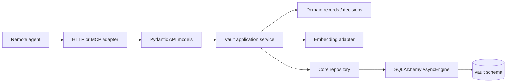
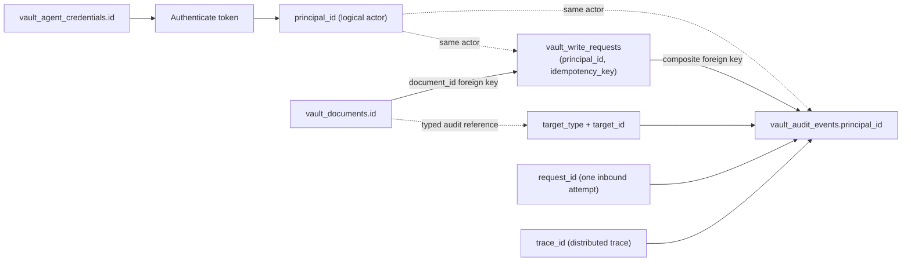

# Vault architecture and integration

**Status:** implementation plan

**Runtime owner:** HighScoreServer

**Knowledge/governance owner:** the private knowledge-platform repository

**Persistence decision:** [vault ADR 0001](adr/0001-sqlalchemy-core-for-vault-bounded-context.md)

**Configuration runbook:** [Vault configuration and Heroku operations](vault-configuration.md)

## Repository boundary

HSS initially hosts the deployed vault runtime: authentication, authorization, rate limits,
HTTP/MCP transport, Postgres persistence, embeddings, retrieval, governed writes, audit
records, and consistent exports. This is service composition, not a permanent decision that
the public leaderboard repository must own the knowledge product. It remains safe for this
repository to be public because code, table definitions, migrations, and governance rules
are not the knowledge corpus.

The private knowledge-platform repository owns human-authored Markdown, the source Agent
corpus used for migration, governance prose and source schemas, the knowledge compiler, and
the deterministic Markdown projector used by Obsidian. Vault content, export snapshots,
fixtures containing real notes, credentials, and embedding vectors must never be committed
to HSS, included in container layers, or emitted to logs/CI artifacts.

Do not combine the repositories at build or deploy time. HSS must not clone the private
knowledge-platform repository, use it as a Git submodule, or depend on Syncthing. Port the
non-secret validation and decision-policy behavior into the HSS vault package with its tests.
Copy versioned governance schemas only when the HSS runtime needs them, recording their
source version/hash. Ongoing governance changes arrive as ordinary reviewed HSS code/schema
changes; they do not provide a back door for uploading vault content.

After cutover, agents use HSS. The knowledge-platform projector pulls an authenticated,
consistent export and renders the human-readable `Vault/Agent/` Markdown projection locally.
Syncthing distributes that projection only to human devices.

## Eventual repository and CI composition

An `app/vault/` package supplies code-level separation, but it does not by itself preserve
repository focus. The eventual target inverts the dependency at the private deployment
boundary:

```text
public HighScoreServer ───────────────┐
                                     ├─> private composition CI ─> one Heroku artifact
private knowledge-platform runtime ──┘
```

Neither product repository imports the other's domain:

- HSS exports its leaderboard FastAPI application factory and remains independently
  deployable for leaderboard-only consumers.
- The private knowledge runtime exports a standalone FastAPI/ASGI application or installable
  extension and remains independently deployable for knowledge-only consumers.
- A thin private composition root owns route ordering, the combined lifespan, shared
  deployment configuration, and execution of both Alembic lineages.

The preferred first composition owner is the private knowledge-platform workflow. It checks
out an immutable HSS tag/commit beside its own code and stages a build from an explicit
allowlist. The public repository never receives a credential capable of reading the private
repository. If composition acquires its own release cadence, environments, or multiple
component combinations, move the manifest/workflow into a small third private deployment
repository.

Private CI must:

1. read a component lock containing immutable repository revisions;
2. check out components side by side rather than copying one repository's source history
   into the other;
3. run HSS and knowledge-runtime tests independently;
4. run composition, route-order, migration, and contract tests against the assembled app;
5. build from a fresh allowlisted staging directory;
6. fail if `Vault/`, export snapshots, `.git`, `.env`, credentials, real note fixtures, or
   other corpus paths appear in the staged tree or final artifact;
7. publish provenance containing both source revisions.

Git submodules can prototype the pinning but are not the preferred release contract because
private-submodule authentication and updates are easy to make implicit. GitHub Actions
supports side-by-side repository checkouts; a secondary private repository requires an
explicit least-privilege credential because the workflow token is scoped to its own
repository. A prebuilt combined image can be pushed and released through Heroku Container
Registry, but changing HSS from its current buildpack deployment to a maintained container is
a separate implementation decision.

Extract the runtime when any of these occurs:

- the first consumer needs only the leaderboard or only the knowledge service;
- either component needs an independent release cadence or ownership history;
- combined CI materially slows isolated component changes;
- private/public security review is clearer with separate source boundaries;
- another deployment wants to compose one component differently.

Until then, keep the initial package at the same boundary so extraction is a file/package
move plus composition wiring, not a rewrite.

## Initial HSS staging hierarchy

Add the knowledge platform as one bounded package rather than more flat modules:

```text
app/
  main.py                    lifespan + router composition
  db.py                      existing leaderboard psycopg pool
  vault/
    __init__.py
    api_models.py            Pydantic HTTP/MCP inputs and outputs
    domain.py                VaultDocument, VaultSearchHit, decisions
    tables.py                schema-qualified SQLAlchemy Core Tables
    db.py                    vault AsyncEngine lifecycle/configuration
    repository.py            Core/SQL statements + RowMapping conversion
    service.py               use cases, policy, transaction ownership
    governance.py            validation and conservative decision policy
    embeddings.py            async provider adapter
    auth.py                  agent credentials and scope checks
    routes.py                /api/v1/vault HTTP adapter
    mcp.py                   /mcp/v1/vault thin MCP adapter
    export.py                consistent projector snapshot service
    AGENTS.md                conventions that travel with the package
    docs/
      vault-architecture.md
      vault-configuration.md
      vault-extraction-manifest.md
      adr/                   vault-owned ADR lineage, numbered from 0001
vault_migrations/
  env.py                     VAULT_DATABASE_URL, falling back to DATABASE_URL
  versions/                  vault-only Alembic revisions
tests/
  vault/
    ...                      unit, contract, and Postgres/pgvector integration tests
alembic-vault.ini            dedicated vault migration lineage
```

Documentation lives under the package rather than in the host repository's `docs/`, so
extraction moves it automatically. `vault_migrations/` and `alembic-vault.ini` sit at the
repository root and are separate moves — see `vault-extraction-manifest.md`.

Start with one `repository.py` and one `service.py`; split them by use case only when their
size or independent change rate justifies it. This avoids both the current route-level SQL
coupling and a premature forest of abstractions.

The request path is:



Routes and MCP adapters contain no SQL. Repositories contain no HTTP behavior, embedding
calls, or policy decisions. Services own transaction boundaries. Domain records contain only
business-relevant fields; they do not automatically carry vectors or generated search
columns. API responses map deliberate subsets of those records.

`app.main` initializes and disposes the vault engine in the existing FastAPI lifespan and
includes the vault HTTP/MCP routers before the SPA/static catch-all. The engine is created
once per worker, never per request.

### Identity and request correlation

Credential identity, durable write identity, and request tracing serve different purposes:



- A credential ID selects one rotatable bearer credential. Its `principal_id` names the
  stable logical actor, so multiple credentials may authenticate the same principal.
- `(principal_id, idempotency_key)` names one logical write and remains stable across
  retries. A write-related audit event repeats those columns and references that write
  request; read and system events leave `idempotency_key` null.
- `target_type` and `target_id` form a polymorphic audit reference. They are either both
  present or both absent. They deliberately do not reference a target table because audit
  history must survive target deletion and may describe several resource types.
- `request_id` identifies one inbound attempt. A retry has a new request ID but can refer
  to the same idempotent write.
- `trace_id` comes from the distributed tracing context and may group multiple requests
  and audit events. Request and trace IDs are correlation values, not database entities.

## Database topology

The design supports two deployment modes from its first migration.

### Mode A: one database, separate schemas — initial recommendation

```text
Heroku Postgres
├── public                 existing leaderboard/auth tables + alembic_version
└── vault                  vault tables + vault_alembic_version
```

When `VAULT_DATABASE_URL` is unset, the vault engine and vault Alembic environment fall back
to `DATABASE_URL`. Every vault `Table` and SQL statement is schema-qualified as `vault.*`.
Use a distinct Alembic version table such as `vault.vault_alembic_version`; never share the
leaderboard revision history.

Benefits:

- no second Postgres add-on at the start;
- one operational endpoint and simpler local development;
- clean table namespace and migration ownership;
- schema-scoped export/restore provides a rehearsable path to a second database.

Costs:

- backups, restores, capacity, maintenance, and outages are shared;
- an owner credential can still access both schemas, so schemas alone are not a security
  boundary;
- two application pools still consume the same database connection limit.

Use separate least-privilege runtime roles where the environment supports them, but do not
claim that role separation protects the vault from a compromised HSS process: the process
must possess whichever credentials it uses.

### Mode B: two physical databases — supported isolation

```text
Leaderboard Postgres         Vault Postgres
└── public                   └── vault
```

Set `VAULT_DATABASE_URL` to the second add-on. The application code, schema-qualified tables,
and vault migration history remain unchanged. The release phase runs the leaderboard and
vault Alembic lineages against their respective URLs.

Benefits:

- independent backup/restore and maintenance;
- independent capacity and scaling;
- smaller migration and operator blast radius;
- distinct credentials and database-level audit boundaries.

Costs:

- another paid add-on and more operational work;
- separate connection limits and monitoring;
- no ordinary atomic transaction across leaderboard and vault.

Vault tables must therefore have no foreign keys to `public.users` or any other leaderboard
table. Agent principals and credentials are vault-owned records. If a future feature needs a
relationship to an HSS user, store an opaque external identifier and coordinate through an
application workflow rather than creating a cross-context foreign key.

Apply that rule in Mode A as well as Mode B. Do not add cross-schema foreign keys, views,
triggers, shared sequences, or transactions merely because both schemas currently share a
database. The `vector` extension is database-wide infrastructure; the destination database
must enable it before restoring the `vault` schema.

### When to choose the second database

Start with Mode A while the workload is small, provided the connection-budget check passes.
Move to Mode B when any of these becomes true:

- vault backup/restore or retention must be independent of leaderboard data;
- operators require separate database credentials or audit boundaries;
- vector storage/search materially competes with leaderboard latency or capacity;
- either workload needs a different Postgres plan, maintenance window, or scaling policy;
- migrations or operational mistakes need a smaller database-level blast radius;
- the value or sensitivity of the corpus justifies the additional recurring cost.

Moving is an explicit maintenance operation: stop vault writes, take a consistent
schema-qualified dump/export, restore it to the new database, run the vault migration lineage,
verify counts/hashes/search fixtures, set `VAULT_DATABASE_URL`, and resume. Leaderboard
traffic need not move.

## Connections and transactions

The current Procfile runs two Gunicorn workers. Each worker owns a legacy psycopg pool whose
configured maximum is 10, so the current theoretical application maximum is already 20
leaderboard connections. The vault adds one SQLAlchemy `AsyncEngine` pool per worker.

Before choosing a vault pool size or deploying either topology, obtain the actual connection
limit of each target Postgres plan and prove:

```text
(legacy pool maximum + vault pool maximum) × web worker count
  + release/migration connections + operator reserve
  <= database connection limit
```

For a separate vault database, calculate the two database budgets independently. Configure
the vault engine with an explicit `pool_size`, `max_overflow=0`, stale-connection checking,
and pool utilization/checkout-latency metrics. Keep at least 25% of each database's limit
unallocated. If Mode A cannot meet this without starving a workload, either reduce/unify
pool ownership or use Mode B before deployment.

A service begins a transaction with one vault `AsyncConnection` and passes it into every
participating repository. Repositories never acquire hidden connections. Embedding calls
occur before governed-write transactions. A transaction cannot span Mode-B databases; do
not build a two-phase commit path.

## Migration and release ownership

The existing `migrations/` lineage continues to own `public` leaderboard objects and read
`DATABASE_URL`. The new `vault_migrations/` lineage owns only `vault.*` objects and reads
`VAULT_DATABASE_URL`, falling back to `DATABASE_URL`.

The Heroku release command runs both upgrades and aborts the release if either fails
(`scripts/release.sh`); the vault lineage is gated on `VAULT_ENABLED` so an unverified
pgvector plan cannot abort unrelated deploys. Importing Markdown and generating embeddings are resumable operational jobs, not
Alembic migrations. A release migration never reads the private repository or calls an
embedding provider.

Required deployment tests:

- build both lineages into an empty shared database and confirm separate version tables;
- build the leaderboard and vault lineages into two empty databases;
- prove vault migrations do not create or alter leaderboard objects;
- prove leaderboard migrations do not create or alter vault objects;
- run upgrade/downgrade tests against PostgreSQL with pgvector;
- verify the connection budget for the actual Heroku worker count and database plan.

## Initial implementation sequence

1. Add the vault Alembic environment, schema, engine lifecycle, table metadata, and
   migration/drift tests.
2. Port non-secret governance validation and conservative decision behavior into
   `app/vault/`; automatic merge/link bands remain disabled.
3. Ship authenticated read-only HTTP and MCP access: hybrid search, note retrieval, and
   citation-ready results.
4. Add consistent export for the local Markdown projector.
5. Add governed writes: validate, embed, transactional dedup/decision, insert or flag.
6. Import and verify the private Agent corpus through an operator job, run dual-read, then
   cut agents over to HSS.
7. When an extraction trigger becomes real, move the already-isolated vault package to the
   private runtime and add pinned multi-repository composition CI plus artifact-content gates.

The detailed transport, authentication, rate-limit, tool-schema, projection, and cutover
contracts are maintained with the private knowledge-platform planning documents until their
corresponding HSS implementation slice lands. Each implemented public contract must then be
checked into HSS beside its code and contract tests.

## Deployment references

- [GitHub Actions checkout: multiple repositories and private-repository credentials](https://github.com/actions/checkout)
- [Heroku Container Registry and CI/CD deployment](https://devcenter.heroku.com/articles/container-registry-and-runtime)

## Deferred decisions

Open questions surfaced during the persistence foundation and the read-only slice. Item 1 blocks
the importer. Item 2 is a boundary question with no deadline. Item 3 is shipped, working, and
deliberately provisional — it is listed because the values were chosen by reasoning rather than
measurement, and should not be mistaken for settled.

Three questions that were open after Phase 1 have since been settled and are no longer listed
below: the embedding provider and `profile_id` identity (vault ADR 0005), how the two retrieval
arms combine (vault ADR 0006), and the divergence between `document_kind_enum` and the governance
Type Dictionary (vault ADR 0009, which keeps `kind` coarse and adds a nullable `doc_type TEXT`
validated in application code against `types.yml`; migration `0002_document_doc_type`). The missing
path column is settled too: vault ADR 0010 adds `vault_path TEXT NOT NULL UNIQUE` and rules out a
resolved `policy_scope` column, and vault ADR 0011 adds `doc_status TEXT` for the Status Map values
`status` cannot represent — both in migration `0003_vault_path_doc_status`. Still open,
and unchanged by the read-only slice: the **partial HNSW index per profile**, which becomes
necessary only when a second profile is populated, and the **dimension-change DDL shape**, which is
deliberately left until a dimension change is actually proposed. Both are described in
`vault-configuration.md`.

### 1. No read-permission model for whole-vault scope

Staleness and deletion are settled — mark-and-sweep over `source_sha256` (ADR 0012) — and so is
what gets embedded (ADR 0013). The database is a **replica** of `Human/**` and the **system of
record** for `Agent/**`; `source_sha256 IS NULL` is a row saying it has no upstream file.

What remains open is access. **`folders.yml` governs `ai_write` and has no `ai_read` at all.** With
the whole vault readable by any credential holding `vault:read`, one scope reads everything,
including `Human/07 People/**` — notes about real people. ADR 0008's remark that archived is a
visibility state rather than a privacy one was written for an agent-authored corpus and does not
carry to whole-vault scope.

Nothing in the schema blocks on this; the columns are the same either way. It should be settled
before anything imports the human layer, not after.

### 2. Governance artifacts split across the source/knowledge boundary

`folders.yml`, `types.yml`, and `global.yml` are executable policy and belong in source:
policy cannot live inside the store it governs, or it can rewrite its own rules.

The doctrine prose (`Metadata Standard.md`, `Status Map.md`, `Type Dictionary.md`) stays
vault-side, but should be generated from the YAML and CI-checked, following the `sync_skill.py`
precedent. Governance prose then reaches the database the same way the wiki layer does — as a
compiled read-only projection — rather than as a second source of truth that can silently
contradict the YAML.

### 3. The embedding request budget is provisional — active consideration

**Status: shipped and working. Revisit with usage data, not before.**

The query path currently allows **one attempt at a 10s timeout** and no retry
(`_MAX_ATTEMPTS`, `_MAX_BACKOFF_SECONDS` in `embeddings_openai.py`;
`VAULT_EMBEDDING_TIMEOUT_SECONDS` for the timeout). The budget exists because running out of it
is not a failure — it is the fall back to lexical results — and that is only worth anything if it
happens while a caller is still waiting. Heroku's router gives up at 30s, so the whole budget
must fit inside that with room for the search itself.

The main alternative considered was **three attempts at a 5s timeout**: 16.5s in the ordinary
worst case, 23s if a `Retry-After` maxes the 4s cap twice, so it also fits. Its appeal is that
the realistic failure is a transient 429 or 502 rather than genuine slowness, and today a single
blip costs the vector arm entirely. It was not adopted because the argument for it rests on
`text-embedding-3-small` returning a single short embedding in well under a second, which is
general knowledge about the model rather than anything measured against this deployment.

What would settle it, in rough order of value:

1. **p50/p99 latency of a single query embedding** against the real API. If p99 is comfortably
   under 5s, three attempts at 5s is the better configuration. If it is near 5s, a short timeout
   converts slow-but-successful calls into failures and then retries into the same wall — the one
   genuinely bad outcome available here.
2. **How often embedding actually fails in practice**, from the `vector_status="failed"` rate.
   Retries are worth adding only if transient failure is real; if the rate is ~0, the current
   single attempt is correct and simpler.
3. **Batch latency at realistic sizes.** `VAULT_EMBEDDING_TIMEOUT_SECONDS` is one setting shared
   by the single-query path and the batch path, where `DEFAULT_BATCH_SIZE` is 128. A value chosen
   for queries may be too tight for a full batch of long documents. The importer will likely need
   its own value — it is already configuration, so a separate process can set it — and at that
   point the default should be documented as the query-path default rather than a general one.

Two known imprecisions in the arithmetic above, so nobody re-derives them from scratch: httpx's
read timeout is **per-chunk, not total request duration**, so `attempts × timeout` is an upper
bound for well-behaved responses rather than a hard guarantee; and
`test_worst_case_retry_budget_fits_inside_the_router_timeout` hardcodes the 10s timeout instead
of reading it from configuration, so changing the default without touching that test would leave
it modelling something that is no longer true.
